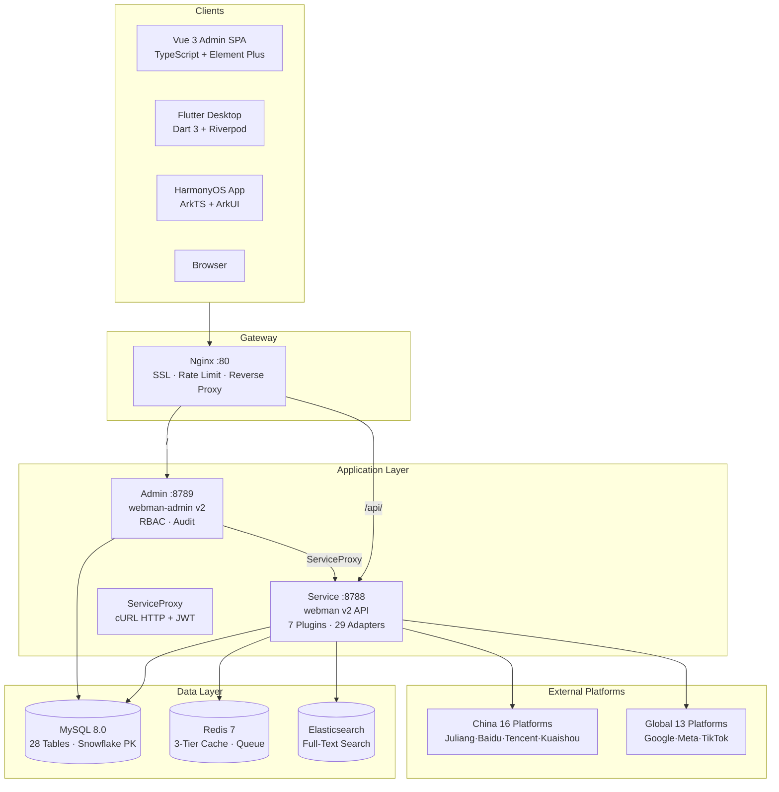
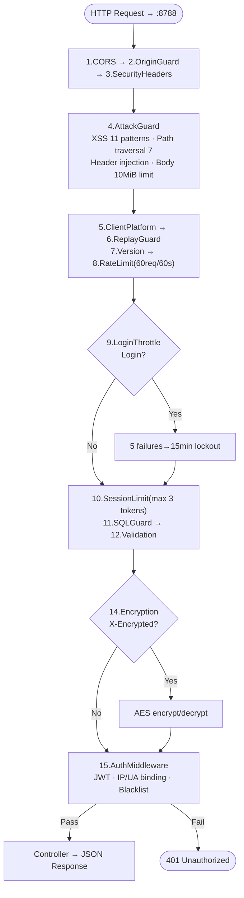
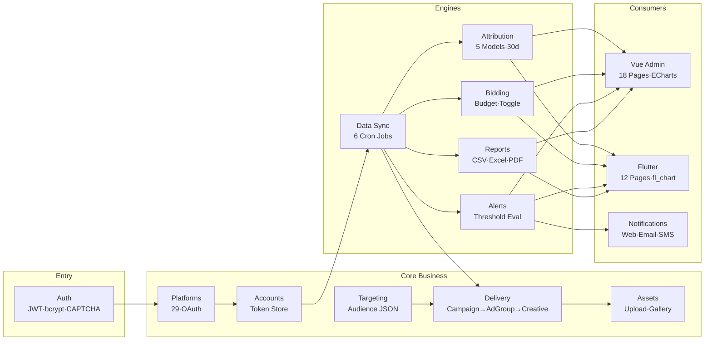
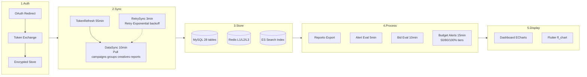

# Ads Platform — Multi-Platform Ad Management System

[中文](README.md) | English

Copyright (c) 2026 erik <erik@erik.xyz> — https://erik.xyz

## Overview

Unified ad management across **29 advertising platforms**, with cross-platform reporting, alert monitoring, auto-bidding, and multi-device access.

> Architecture → [docs/architecture.md](docs/architecture.md)  
> Features → [docs/features.md](docs/features.md)  
> API Reference → [docs/api.md](docs/api.md) | hg/apidoc: `http://127.0.0.1:8788/apidoc`  
> Version Comparison → [docs/versions.md](docs/versions.md) (Lite open-source / Standard & Full: contact erik@erik.xyz)

### Supported Platforms

#### China (16)
| Platform | Adapter | Auth |
|----------|---------|------|
| Juliang (Ocean Engine) | Juliang | OAuth2 Access-Token |
| Baidu Marketing | Baidu | OAuth2 + Envelope Sign |
| Taobao / Alimama | Taobao | OAuth2 + MD5 |
| Tencent Ads | Tencent | OAuth2 + nonce |
| Kuaishou (Kwai) | Kuaishou | OAuth2 URL Params |
| Xiaohongshu (RED) | Xiaohongshu | OAuth2 Bearer |
| Weibo Fans Connect | Weibo | OAuth2 Bearer |
| Bilibili Huahuo | Bilibili | OAuth2 Bearer |
| Youku Ads | Youku | OAuth2 + MD5 |
| Meituan Ads | Meituan | OAuth2 Bearer |
| Zhihu Ads | Zhihu | OAuth2 Bearer |
| Qihoo 360 | Qihoo360 | API Key + Sign |
| Sogou | Sogou | API Key + Sign |
| Umeng | Umeng | API Key + MD5 |
| JD Jingzhuntong | Jingdong | OAuth2 + MD5 |
| Pinduoduo Ads | Pinduoduo | OAuth2 + Custom Sign |

#### International (13)
| Platform | Adapter | Auth |
|----------|---------|------|
| Google Ads | Google | OAuth2 + GAQL |
| YouTube Ads | Youtube | OAuth2 + GAQL |
| Meta Ads | Meta | OAuth2 URL Params |
| TikTok Ads | Tiktok | OAuth2 Access-Token |
| LinkedIn Ads | Linkedin | OAuth2 Bearer |
| Snapchat Ads | Snapchat | OAuth2 Bearer |
| Pinterest Ads | Pinterest | OAuth2 Bearer |
| Twitter/X Ads | Twitter | OAuth2 Bearer |
| Amazon Ads | Amazon | OAuth2 + Profile |
| The Trade Desk | TheTradeDesk | HMAC-SHA256 |
| Spotify Ads | Spotify | OAuth2 Bearer |
| Twitch Ads | Twitch | OAuth2 Bearer + ClientId |
| Netflix Ads | Netflix | OAuth2 client_credentials |

---

## Tech Stack

| Layer | Technology | Notes |
|-------|-----------|-------|
| Server | webman v2 + PHP 8.2+ | 7 plugins, 65+ API endpoints |
| Database | MySQL 8.0 | 28 tables, `erik_` prefix, Snowflake BIGINT PK |
| Cache | Redis 7 | 3-tier cache (L1 memory / L2 APCu / L3 Redis), rate limiting, Pub/Sub, message queue |
| Search | Elasticsearch | webman-scout auto index sync (configured) |
| Admin Panel | webman-admin v2 + Vue 3 + TypeScript + Element Plus | PHP backend (port 8789), ServiceProxy calls business API (port 8788), 18 pages, ECharts |
| Flutter | Dart 3 + Riverpod + GoRouter + fl_chart | PC/Mobile responsive, Desktop Shell layout, 12 pages |
| HarmonyOS | ArkTS + ArkUI | HTTP client ready, UI planned |
| Deployment | Docker + Nginx + GHCR | Docker Compose one-command start, GitHub Actions CI/CD |

## Architecture Diagram



### Request Flow



### Functional Modules



### Data Lifecycle



> Full versions with all annotations, Admin pipeline, cron Gantt chart, cache state machine → [docs/diagrams/](docs/diagrams/)

## Architecture Notes

- **`service/`** — webman v2 user-facing business API, port **8788**. Handles ad platform integration, OAuth, data sync, reporting engine, alert monitoring.
- **`admin/`** — webman-admin v2 standalone admin panel, port **8789**. PHP backend (auth, user management, system config) + Vue 3 SPA frontend.
- **Admin-to-Service Communication** — Admin uses `ServiceProxy` (cURL-based HTTP proxy) to call service API, forwarding requests with JWT tokens.
- **Dev Mode** — Vite dev server (port 5173) proxies `/api` to service:8788; admin PHP backend on 8789 provides session auth and SPA static serving.
- **Production** — Nginx routes `/` to admin:8789 (admin SPA), `/api/` to service:8788 (business API).

## Erik Stack Integration

| Package | Purpose |
|---------|---------|
| `erikwang2013/snowflake-php` | Distributed Snowflake ID generation |
| `erikwang2013/hashids` | API ID parameter obfuscation |
| `erikwang2013/jwt-webman` | JWT authentication tokens |
| `erikwang2013/encryption` | API-layer sensitive data encryption |
| `erikwang2013/encryptable` | DB field-level auto encryption |
| `erikwang2013/webman-scout` | Elasticsearch data sync |
| `erikwang2013/season` | Country flag identifiers |
| `erikwang2013/poster-php` | Slider CAPTCHA (login protection) |
| `hg/apidoc` | Auto-generated API docs (annotations + Web UI) |

## Internationalization

All interfaces support **Chinese (zh-CN)** / **English (en)** bilingual switching:

| End | Technology | Switch |
|-----|-----------|--------|
| Admin | vue-i18n v9 | TopBar language dropdown, localStorage persistence |
| Service API | `erik\support\I18n` | Accept-Language header / `?lang=` parameter |
| Flutter | AppLocalizations + Delegate | System language auto-detect |
| HarmonyOS | StringResources | `setLang()` toggle |

## Security

### Service (14 global + AuthMiddleware)

CORS → OriginGuard → SecurityHeaders → AttackGuard → ClientPlatform → ReplayGuard → Version → RateLimit → LoginThrottle → SessionLimit → SQLGuard → Validation → ResponseTime → Encryption → AuthMiddleware (route-level)

### Admin (10 global + AuthCheck)

CORS → SecurityHeaders → AttackGuard → ClientPlatform → Version → RateLimit → LoginThrottle → SQLGuard → Validation → CSRF → AuthCheck (route-level)

### Defense Summary (22 items)

| Category | Protection | Details |
|----------|-----------|---------|
| Input Detection | XSS (11 patterns) | script/iframe/event handler/javascript:/data: |
| | Path Traversal (7 patterns) | ../ / null byte / /etc/passwd / .env / .git |
| | Header Injection | CRLF detection |
| | Body Size Limit | 10 MiB |
| | Content-Type Whitelist | JSON/Form/Multipart/Plain |
| | SQL Injection | UNION/DROP/ALTER pattern detection |
| Authentication | JWT Token Binding | IP + User-Agent hash verification |
| | Token Refresh + Blacklist | Old tokens auto-invalidated |
| | Login Throttle | 5 failures → 15 min lockout (Redis) |
| | Concurrent Session Limit | Max 3 active tokens per user |
| | CAPTCHA | Slider CAPTCHA (5 min valid, 5px tolerance) |
| Request Validation | CORS Whitelist | Production domain whitelist |
| | Origin/Referer Check | Cross-origin source verification |
| | CSRF Token | Admin session token verification |
| | Anti-Replay | Nonce + Timestamp ±5min (non-browser) |
| | Rate Limiting | Sliding window 60 req/60s |
| | SSRF Protection | OAuth redirect_uri whitelist |
| Response Headers | CSP | Content-Security-Policy (SPA) |
| | X-Frame-Options / HSTS | Anti-clickjacking + HTTPS enforcement |
| | X-Content-Type-Options | nosniff |
| Data Protection | Transport Encryption | EncryptionMiddleware (X-Encrypted) |
| | Storage Encryption | Encryptable (DB field-level) |
| | Log Redaction | password/token/secret → `***` |

**Authentication**: Unified `admin_users` table + bcrypt hashing across service and admin, JWT 24h + refresh rotation.

**Auditing**: All operations logged with IP / User-Agent / Client-Platform / action details.

**Confirmation**: Delete/unbind/batch operations use "type-to-confirm" pattern (`GlobalConfirm` + `useConfirmStore`).

---

## Advanced Features

| Feature | Description | Technology |
|---------|-------------|------------|
| Asset Library | Image/video upload, gallery preview, copy URL | AssetController + Vue Gallery |
| Budget Alerts | Daily budget real-time tracking, 3-tier alerts (50/80/100%) | BudgetAlertService + 15min Cron |
| Campaign Calendar | Cross-platform Gantt chart, month/week views, color-coded | CalendarService + Vue Gantt |
| Cross-Platform Attribution | 5 attribution models (first/last/linear/time_decay/position_based), 30-day lookback | AttributionEngine + ECharts |

---

## High Concurrency

| Optimization | Approach | File |
|-------------|----------|------|
| DB Read/Write Split | Primary `shared` + read replica `read_replica`, SELECT auto-routed | `config/database.php` |
| DB Connection Pool | `PDO::ATTR_PERSISTENT` + timezone init warmup | `config/database.php` |
| Redis Connection Pool | `persistent` connections + read/write split `readonly` config | `config/redis.php` |
| 3-Tier Cache | L1 process memory → L2 APCu shared → L3 Redis | `support/CacheService.php` |
| Async Message Queue | Redis List 4 channels (sync/report/export/notification) | `support/AsyncJobService.php` |
| Nginx Tiered Rate Limit | 30r/s + burst 20 + 20 concurrent + keepalive 32 | `docker/nginx/admin.conf` |
| Horizontal Scaling | upstream multi-instance + failover + sticky session | `docker/nginx/admin.conf` |
| CDN Acceleration | Static assets `expires 30d` + `immutable` + `gzip_static` | `docker/nginx/admin.conf` |

---

## Quick Start

### One-Click Web Install (Recommended)

Start the server and visit `/install` for the setup wizard:

```bash
# Start admin panel (port 8789)
cd admin && composer install && php start.php start

# Open http://localhost:8789/install in your browser
# Fill in database info, admin account, click "Install"
```

The wizard guides you through:
1. **Database Connection** — MySQL host, port, database name, credentials, with connection test
2. **Redis Configuration** — Redis connection settings (optional)
3. **Admin Account** — Backend login username, password, display name
4. **One-Click Install** — Auto-create database, run `install.sql` to create 28 tables with seed data, set admin password

After installation, visit `/` and log in with your configured credentials.

### Docker (Recommended for Production)

```bash
# Start all services (MySQL + Redis + PHP + Nginx)
docker-compose up -d

# Initialize database (create tables + seed data)
make db-init

# Access
# Admin Panel: http://localhost
# Install Wizard: http://localhost/install
# API: http://localhost/api (Header: X-API-Version: v1)
```

### Local Development

```bash
# Service API (port 8788)
cd service && composer install && php start.php start

# Admin Panel (port 5173)
cd admin/public/web && npm install && npm run dev

# Flutter App
cd apps/flutter && flutter run -d chrome  # Web PC
# HarmonyOS App
# Open apps/harmonyos in DevEco Studio
cd apps/flutter && flutter run -d android # Mobile

# TypeScript Check
cd admin/public/web && npx vue-tsc --noEmit   # zero errors
```

---

## Project Structure

```
ads-php/
├── service/                           # Business API service (webman v2 :8788)
│   ├── plugin/
│   │   ├── ads-api/                   # REST API (45+ endpoints, versioned routes)
│   │   │   ├── controller/v1/         # 14 controllers
│   │   │   ├── middleware/            # 7 middleware
│   │   │   ├── config/route.php       # Route definitions
│   │   │   └── route_helpers.php      # versioned() helper
│   │   ├── ads-platform/              # Platform adapter core
│   │   │   ├── adapter/               # 29 platform adapters
│   │   │   ├── src/                   # AdapterRegistry, CampaignData
│   │   │   ├── model/                 # BidRule, BidLog, TargetingTemplate
│   │   │   ├── service/               # BidEngine, ReportBuilder
│   │   │   └── migration/             # SQL migrations + performance indexes
│   │   ├── ads-account/               # OAuth account management
│   │   ├── ads-task/                  # Scheduled tasks (6 cron jobs)
│   │   ├── ads-alert/                 # Alert monitoring engine + budget alerts
│   │   ├── ads-report/                # Reporting engine (CSV/Excel/PDF) + attribution + calendar
│   │   └── ads-tenant/                # Multi-tenant management
│   ├── support/                       # Erik Stack utilities
│   │   ├── ControllerTrait.php        # Controller shared trait
│   │   ├── JwtService.php             # JWT wrapper
│   │   ├── CacheService.php           # Redis cache service
│   │   ├── ExceptionHandler.php       # API exception handler
│   │   └── ApiResponse.php            # Unified response format
│   ├── config/                        # Global config (DB/Redis/Log/Middleware)
│   ├── tests/                         # PHPUnit tests (35 tests)
│   │   ├── Unit/                      # Unit tests (Middleware, Task)
│   │   └── Integration/               # Integration tests (Auth, Health)
│   └── start.php                      # Service entry point
├── admin/                             # Standalone admin panel (webman-admin v2 :8789)
│   ├── public/web/src/
│   │   ├── views/                     # 15 Vue pages
│   │   │   ├── dashboard/             # Dashboard (ECharts)
│   │   │   ├── campaign/              # Campaigns
│   │   │   ├── adgroup/               # Ad Groups
│   │   │   ├── creative/              # Creatives
│   │   │   ├── report/                # Reports + export
│   │   │   ├── alert/                 # Alert rules + logs
│   │   │   ├── notification/          # Notification center
│   │   │   ├── bid/                   # Auto-bid rules
│   │   │   └── system/                # User management + audit logs
│   │   ├── api/                       # 9 API clients
│   │   ├── stores/                    # 4 Pinia stores
│   │   └── components/                # Shared components (ListPageLayout etc.)
│   ├── app/                           # PHP backend (controller/middleware)
│   └── config/                        # Admin config
├── apps/
│   ├── flutter/                       # Flutter Desktop App
│   │   └── lib/
│   │       ├── features/              # 12 feature pages + Shell layout
│   │       ├── config/menu_config.dart # 2-level menu config
│   │       ├── router.dart            # GoRouter (ShellRoute + route guard)
│   │       └── stores/                # Riverpod Auth Provider
│   └── harmonyos/                     # HarmonyOS (API Client ready)
├── docker/                            # Docker & Nginx config
├── .github/workflows/                 # CI (lint→test→TS→Docker) + CD (build→push)
├── docs/                              # Design docs, implementation plans, Skills
├── docker-compose.yml
├── Dockerfile / Dockerfile.admin / Dockerfile.admin-php
└── Makefile
```

## API Endpoints

> All endpoints require header `X-API-Version: v1`. Version numbers do not appear in URL paths.

### Auth & Basics

| Method | Path | Description |
|--------|------|-------------|
| POST | /api/auth/login | Login, get JWT token |
| GET | /api/auth/me | Current user info |
| POST | /api/auth/refresh | Refresh JWT (old token auto-blacklisted) |
| GET | /api/platforms | List of 29 adapter platforms (cached 1h) |
| GET | /api/platforms/:code/oauth-url | Get OAuth authorization URL |
| POST | /api/platforms/:code/callback | OAuth callback handler |
| GET | /health | Health check (DB + Redis connectivity) |
| GET | /ping | Lightweight liveness probe |
| GET | /docs | API documentation (HTML) |
| GET | /api/captcha/generate | Generate slider CAPTCHA |
| POST | /api/captcha/verify | Verify CAPTCHA offset |

### Campaigns

| Method | Path | Description |
|--------|------|-------------|
| GET | /api/campaigns | List (filter/sort/paginate, includes today's summary) |
| POST | /api/campaigns | Create campaign |
| GET | /api/campaigns/:id | Detail (includes today's metrics) |
| PUT | /api/campaigns/:id | Update campaign |
| POST | /api/campaigns/:id/toggle | Toggle campaign status |
| POST | /api/campaigns/batch/toggle | Batch toggle |

### Ad Groups

| Method | Path | Description |
|--------|------|-------------|
| GET | /api/ad-groups | List (filter by platform/campaign_id/status) |
| POST | /api/ad-groups | Create ad group (supports targeting templates) |
| GET | /api/ad-groups/:id | Detail (includes today's metrics) |
| PUT | /api/ad-groups/:id | Update ad group |
| POST | /api/ad-groups/:id/toggle | Toggle ad group status |

### Creatives

| Method | Path | Description |
|--------|------|-------------|
| GET | /api/creatives | List (filter by platform/ad_group_id/media_type) |
| GET | /api/creatives/:id | Detail (includes today's metrics) |

### Reports

| Method | Path | Description |
|--------|------|-------------|
| GET | /api/reports/summary | Dashboard summary (cached 5 min) |
| GET | /api/reports/custom | Custom multi-dimension report |
| GET | /api/reports/export | Export CSV/Excel |
| GET | /api/reports/export-dashboard | Export dashboard PDF |

### Accounts

| Method | Path | Description |
|--------|------|-------------|
| GET | /api/accounts | Bound account list (cached 5 min) |
| GET | /api/accounts/:id | Account detail (cached 5 min) |
| DELETE | /api/accounts/:id | Unbind account |
| POST | /api/accounts/:id/sync | Manual data sync trigger |

### Alerts

| Method | Path | Description |
|--------|------|-------------|
| GET | /api/alerts/rules | Alert rules list (cached 2 min) |
| POST | /api/alerts/rules | Create alert rule |
| PUT | /api/alerts/rules/:id | Update alert rule |
| DELETE | /api/alerts/rules/:id | Delete alert rule |
| GET | /api/alerts/logs | Alert logs (filter by status) |
| POST | /api/alerts/logs/:id/acknowledge | Acknowledge alert |
| GET | /api/alerts/unread-count | Unread alert count (cached 30s) |

### Notifications

| Method | Path | Description |
|--------|------|-------------|
| GET | /api/notifications | Notification list (filter by type/is_read) |
| GET | /api/notifications/unread-count | Unread notification count |
| POST | /api/notifications/:id/read | Mark single as read |
| POST | /api/notifications/read-all | Mark all as read |

### Auto-Bidding

| Method | Path | Description |
|--------|------|-------------|
| GET | /api/bid-rules | Rule list |
| POST | /api/bid-rules | Create bid rule |
| PUT | /api/bid-rules/:id | Update bid rule |
| DELETE | /api/bid-rules/:id | Delete bid rule |
| GET | /api/bid-rules/logs | Bid adjustment history |

### Targeting Templates

| Method | Path | Description |
|--------|------|-------------|
| GET | /api/targeting-templates | Template list (filter by platform) |
| GET | /api/targeting-templates/:id | Template detail |
| POST | /api/targeting-templates | Create targeting template |
| PUT | /api/targeting-templates/:id | Update targeting template |
| DELETE | /api/targeting-templates/:id | Delete targeting template |

### Admin Endpoints (port 8789)

| Method | Path | Description |
|--------|------|-------------|
| GET | /install | One-click install wizard (no auth) |
| POST | /api/install/check | Test database connection |
| POST | /api/install/run | Run installation (DB/tables/seeds/admin) |
| GET | /api/install/status | Check install status |
| POST | /api/admin/login | Admin login |
| GET | /api/admin/me | Current admin info (includes role & permissions) |
| GET | /api/admin/users | User management list |
| POST | /api/admin/users | Create admin user |
| PUT | /api/admin/users/:id | Update admin user |
| DELETE | /api/admin/users/:id | Disable admin user |
| GET | /api/admin/audit-logs | Audit logs (filter by user/action/date) |
| GET | /api/admin/roles | Available role list |

---

## Database

**Naming Convention**: Table prefix `erik_`, PK `BIGINT UNSIGNED PRIMARY KEY` (no auto-increment, Snowflake ID), engine InnoDB, charset utf8mb4

| Category | Tables | Purpose |
|----------|--------|---------|
| Foundation | `erik_tenants` | Multi-tenancy |
| Accounts | `erik_platform_accounts`, `erik_auth_tokens` | OAuth platform accounts |
| Campaigns | `erik_campaigns`, `erik_ad_groups`, `erik_creatives` | Ad delivery hierarchy |
| Reporting | `erik_report_metrics`, `erik_report_extras` | Unified report metrics |
| Assets | `erik_assets` | Creative asset library |
| Targeting | `erik_targeting_templates` | Audience targeting templates |
| Attribution | `erik_conversions`, `erik_attribution_results` | Conversion tracking + attribution |
| Bidding | `erik_bid_rules`, `erik_bid_logs` | Auto-bid rules + history |
| Alerts | `erik_alert_rules`, `erik_alert_logs` | Alert monitoring |
| Notifications | `erik_notifications` | In-app notifications |
| System | `erik_sync_errors`, `admin_users`, `admin_roles`, `admin_audit_logs` | Sync errors, RBAC, audit |

---

## Scheduled Tasks

| Task | Frequency | Function |
|------|-----------|----------|
| TokenRefreshTask | Every 55 min | Scan expired OAuth tokens, auto-refresh |
| DataSyncTask | Every 10 min | Pull platform campaigns+adgroups+creatives+reports, write to unified tables, clear cache |
| AlertCheckTask | Every 5 min | Iterate enabled alert rules, evaluate thresholds, trigger push |
| BidCheckTask | Every 10 min | Iterate auto-bid rules, query metrics, execute budget adjustment/toggle |
| BudgetCheckTask | Every 15 min | Track daily budget consumption, 3-tier alerts (50/80/100%) |
| RetrySyncTask | Every 3 min | Retry failed sync jobs (max 3 retries, exponential backoff) |

---

## Testing

```bash
cd service && ./vendor/bin/phpunit
# 35 tests / 70 assertions
```

**Coverage**: Middleware (Version/SQLGuard/SecurityHeaders) · Data objects (CampaignData/FieldMapping/Hashids) · Engines (ReportBuilder/AdapterRegistry) · Integration (Auth/Health)

```bash
# TypeScript Check
cd admin/public/web && npx vue-tsc --noEmit   # zero errors

# Dart Analysis
cd apps/flutter && dart analyze   # zero errors
```

## CI/CD

**CI** (`.github/workflows/ci.yml`): Automated pipeline — **PHP Syntax → PHPUnit → TypeScript → Docker Build**

**CD** (`.github/workflows/deploy.yml`): Manual trigger — **Docker Buildx → Push GHCR (service/admin/admin-php) → Deploy notification**

`.github/dependabot.yml` auto-updates Composer + npm + Docker dependencies weekly.

---

## Skills

`docs/skills/` — 11 reusable project skills:

| Skill | Description |
|-------|-------------|
| `adapter-generator` | Generate new ad platform adapter (14-method template) |
| `migration-generator` | Generate SQL migration (`erik_` prefix + BIGINT PK) |
| `erik-stack` | Erik Stack 8-package integration guide |
| `admin-page-generator` | Generate Vue 3 admin page |
| `api-endpoint` | Add RESTful API endpoint |
| `tdd-workflow` | TDD verification workflow (test→implement→lint→TS→commit) |
| `security-middleware` | Add security middleware layer (spec + register + ref existing chain) |
| `version-split` | Lite/Standard/Full version split (steps + config update) |
| `cache-strategy` | 3-tier caching strategy (L1 memory/L2 APCu/L3 Redis + TTL advice) |
| `attribution-setup` | Cross-platform attribution engine (5 models + API calls + data prep) |
| `high-concurrency` | 8 high-concurrency optimizations (R/W split/pooling/queue/scaling/CDN) |

---

## License

Copyright (c) 2026 erik <erik@erik.xyz> — https://erik.xyz

All rights reserved.
