# Ads Platform — 多平台广告管理系统

[中文](README.md) | [English](docs/README.en.md) | [한국어](docs/README.ko.md) | [Русский](docs/README.ru.md) | [Deutsch](docs/README.de.md) | [Français](docs/README.fr.md) | [Español](docs/README.es.md) | [Português](docs/README.pt.md) | [हिन्दी](docs/README.hi.md) | [العربية](docs/README.ar.md) | [বাংলা](docs/README.bn.md) | [Bahasa Indonesia](docs/README.id.md) | [日本語](docs/README.ja.md)

Copyright (c) 2026 erik <erik@erik.xyz> — https://erik.xyz

## 概述

对接 **29 个广告平台**，统一管理广告投放与跨平台数据报表，支持告警监控、自动出价、多端访问。

> 架构设计 → [docs/architecture.md](docs/architecture.md)  
> 功能模块 → [docs/features.md](docs/features.md)  
> API 文档 → [docs/api.md](docs/api.md) | hg/apidoc: `http://127.0.0.1:8788/apidoc`  
> 版本对比 → [docs/versions.md](docs/versions.md)（Lite 开源 / Standard & Full 联系 erik@erik.xyz）

### 支持的平台

#### 国内 (16)
| 平台 | 适配器 | 认证 |
|------|--------|------|
| 巨量引擎 | Juliang | OAuth2 Access-Token |
| 百度营销 | Baidu | OAuth2 + 信封签名 |
| 淘宝/阿里妈妈 | Taobao | OAuth2 + MD5 |
| 腾讯广告 | Tencent | OAuth2 + nonce |
| 快手磁力引擎 | Kuaishou | OAuth2 URL参数 |
| 小红书蒲公英 | Xiaohongshu | OAuth2 Bearer |
| 微博粉丝通 | Weibo | OAuth2 Bearer |
| B站花火 | Bilibili | OAuth2 Bearer |
| 优酷广告 | Youku | OAuth2 + MD5 |
| 美团广告 | Meituan | OAuth2 Bearer |
| 知乎广告 | Zhihu | OAuth2 Bearer |
| 360推广 | Qihoo360 | API Key + Sign |
| 搜狗推广 | Sogou | API Key + Sign |
| 友盟 | Umeng | API Key + MD5 |
| 京东京准通 | Jingdong | OAuth2 + MD5 |
| 拼多多广告 | Pinduoduo | OAuth2 + 自定义Sign |

#### 国际 (13)
| 平台 | 适配器 | 认证 |
|------|--------|------|
| Google Ads | Google | OAuth2 + GAQL |
| YouTube Ads | Youtube | OAuth2 + GAQL |
| Meta Ads | Meta | OAuth2 URL参数 |
| TikTok Ads | Tiktok | OAuth2 Access-Token |
| LinkedIn Ads | Linkedin | OAuth2 Bearer |
| Snapchat Ads | Snapchat | OAuth2 Bearer |
| Pinterest Ads | Pinterest | OAuth2 Bearer |
| Twitter/X Ads | Twitter | OAuth2 Bearer |
| Amazon Ads | Amazon | OAuth2 + Profile |
| The Trade Desk | TheTradeDesk | HMAC-SHA256 |
| Spotify Ads | Spotify | OAuth2 Bearer |
| Twitch Ads | Twitch | OAuth2 Bearer + ClientId |
| Netflix Ads | Netflix | OAuth2 client_credentials |

---

## 技术栈

| 层 | 技术 | 说明 |
|----|------|------|
| 服务端 | webman v2 + PHP 8.2+ | 7 个插件，65+ API 端点 |
| 数据库 | MySQL 8.0 | 28 张表，ads_ 前缀，Snowflake BIGINT 主键 |
| 缓存 | Redis 7 | 三级缓存 (L1内存/L2 APCu/L3 Redis)、限流计数、Pub/Sub、消息队列 |
| 搜索 | Elasticsearch | webman-scout 自动索引同步（已配置） |
| 管理后台 | webman-admin v2 + Vue 3 + TypeScript + Element Plus | PHP 后端(端口 8789)，SPA 直连业务 API(端口 8788)，19 页面，ECharts 可视化 |
| Flutter | Dart 3 + Riverpod + GoRouter + fl_chart | PC/Mobile 响应式，Desktop Shell 布局，12 页面 |
| HarmonyOS | ArkTS + ArkUI | 6 个页面已实现，HTTP 客户端已就绪 |
| 部署 | Docker + Nginx + GHCR | Docker Compose 一键启动，GitHub Actions 自动构建推送 |

## 架构图



### 请求流程图



### 功能模块图



### 数据生命周期图


> 完整版含所有细节标注、Admin 端管道、定时任务甘特图、缓存状态机 → [docs/diagrams/](docs/diagrams/) |

> 详细架构说明、安全架构、高并发设计见 [架构设计文档](docs/architecture.md) | 历史设计规范见 [design.md](docs/superpowers/specs/design.md)

## 架构说明

- **`service/`** — webman v2 用户端业务 API 服务，监听端口 **8788**。处理广告平台对接、OAuth 授权、数据同步、报表引擎、告警监控等业务逻辑。
- **`admin/`** — webman-admin v2 独立管理后台，监听端口 **8789**。包含 PHP 后端（认证鉴权、用户管理、系统配置）和 Vue 3 SPA 前端。
- **管理后台与业务服务的通信** — Vue SPA 通过 axios（baseURL `/api`）直连 service API；admin 专属路由（`/api/admin/*`）由 admin PHP 后端（8789）提供服务，Nginx 按路径分流。
- **开发模式** — Vite dev server (端口 5173) 将 `/api` 代理至 service:8788；admin PHP 后端在 8789 提供 session 认证和 SPA 静态服务。
- **生产模式** — Nginx 将 `/` 路由至 admin:8789（管理后台 SPA），将 `/api/` 路由至 service:8788（业务 API）。

## Erik Stack 集成

| 包 | 用途 |
|----|------|
| `erikwang2013/snowflake-php` | 分布式 Snowflake ID 生成 |
| `erikwang2013/hashids` | API ID 参数加解密 |
| `erikwang2013/jwt-webman` | JWT 认证令牌 |
| `erikwang2013/encryption` | API 层敏感数据加解密 |
| `erikwang2013/encryptable` | DB 字段级自动加解密 |
| `erikwang2013/webman-scout` | Elasticsearch 数据同步 |
| `erikwang2013/season` | 国家旗帜标识 |
| `erikwang2013/poster-php` | 滑块验证码（登录保护） |
| `hg/apidoc` | API 文档自动生成（注解 + Web UI） |

## 国际化

全部界面支持 **中文 (zh-CN)** / **English (en)** 双语切换：

| 端 | 技术 | 切换方式 |
|----|------|---------|
| Admin | vue-i18n v9 | TopBar 语言下拉菜单，localStorage 持久化 |
| Service API | `erik\support\I18n` | Accept-Language 请求头 / `?lang=` 参数 |
| Flutter | AppLocalizations + Delegate | 系统语言自动检测 |
| HarmonyOS | StringResources | `setLang()` 切换 |

## 安全

### Service 端 (14 层全局 + AuthMiddleware)

CORS → OriginGuard → SecurityHeaders → AttackGuard → ClientPlatform → ReplayGuard → Version → RateLimit → LoginThrottle → SessionLimit → SQLGuard → Validation → ResponseTime → Encryption → AuthMiddleware（路由层）

### Admin 端 (10 层全局 + AuthCheck)

CORS → SecurityHeaders → AttackGuard → ClientPlatform → Version → RateLimit → LoginThrottle → SQLGuard → Validation → CSRF → AuthCheck（路由层）

### 防护能力总览 (22 项)

| 分类 | 防护项 | 说明 |
|------|--------|------|
| 输入检测 | XSS (11模式) | script/iframe/event handler/javascript:/data: |
| | 路径遍历 (7模式) | ../ / null byte / /etc/passwd / .env / .git |
| | Header 注入 | CRLF 检测 |
| | Body 大小限制 | 10 MiB |
| | Content-Type 白名单 | JSON/Form/Multipart/Plain |
| | SQL 注入 | UNION/DROP/ALTER 模式检测 |
| 认证 | JWT Token 绑定 | IP + User-Agent hash 验证 |
| | Token 刷新 + 黑名单 | 旧 Token 自动失效 |
| | 登录节流 | 5 次失败 → 15 分钟锁定 (Redis) |
| | 并发会话限制 | 每用户最大 3 个活跃 Token |
| | 验证码 | 滑块验证码 (5分钟有效, 5px 容差) |
| 请求校验 | CORS 白名单 | 生产环境域名白名单 |
| | Origin/Referer 校验 | 跨域来源验证 |
| | CSRF Token | Admin 端 session token 验证 |
| | 防重放攻击 | Nonce + Timestamp ±5min (非浏览器端) |
| | 接口限流 | 滑动窗口 60次/60s |
| | SSRF 防护 | OAuth redirect_uri 白名单 |
| 响应头 | CSP | Content-Security-Policy (SPA) |
| | X-Frame-Options / HSTS | 防点击劫持 + HTTPS 强制 |
| | X-Content-Type-Options | nosniff |
| 数据保护 | 传输加密 | EncryptionMiddleware (X-Encrypted) |
| | 存储加密 | Encryptable (DB 字段级) |
| | 日志脱敏 | password/token/secret → \*\*\* |

### 安全架构图


**防御纵深**：外层（Nginx）→ 入口守卫（5层中间件）→ 身份认证（7项）→ 输入校验（4项）→ 频率控制 → 数据加密 → 审计追溯

**认证**：服务端和 admin 统一用 `admin_users` 表 + bcrypt 哈希，JWT 24h + refresh 轮换

**审计**：所有操作记录 IP / User-Agent / Client-Platform / 操作详情

**二次确认**：删除/解绑/批量操作采用"输入确认词"模式（`GlobalConfirm` + `useConfirmStore`）

---

## 高级功能

| 功能 | 说明 | 技术 |
|------|------|------|
| 素材库 | 图片/视频上传管理、画廊预览、复制 URL | AssetController + Vue 画廊 |
| 预算预警 | 日预算消耗实时追踪、三段告警 (50/80/100%) | BudgetAlertService + 15min Cron |
| 投放日历 | 跨平台 Gantt 图、月/周视图、按平台着色 | CalendarService + Vue Gantt |
| 跨平台归因 | 5 模型归因 (first/last/linear/time_decay/position_based)、30 天回溯 | AttributionEngine + ECharts |

---

## 高并发

| 优化 | 方案 | 文件 |
|------|------|------|
| 数据库读写分离 | 主库 `shared` + 只读副本 `read_replica`，SELECT 自动路由到副本 | `config/database.php` |
| DB 连接池 | `PDO::ATTR_PERSISTENT` 持久连接 + 时区初始化预热 | `config/database.php` |
| Redis 连接池 | `persistent` 持久连接 + 读写分离 `readonly` 配置 | `config/redis.php` |
| 三级缓存 | L1 进程内存 → L2 APCu 共享内存 → L3 Redis | `support/CacheService.php` |
| 消息队列异步 | Redis List 4 通道 (sync/report/export/notification) | `support/AsyncJobService.php` |
| Nginx 分级限流 | 30r/s + burst 20 + 20 并发连接 + keepalive 32 | `docker/nginx/admin.conf` |
| 水平扩展 | upstream 多实例 + 故障转移 + sticky session | `docker/nginx/admin.conf` |
| CDN 加速 | 静态资源 `expires 30d` + `immutable` + `gzip_static` | `docker/nginx/admin.conf` |

---

## 快速启动

### 一键 Web 安装（推荐）

启动服务后浏览器访问 `/install` 进入安装向导：

```bash
# 启动管理后台 (端口 8789)
cd admin && composer install && php start.php start

# 打开浏览器访问 http://localhost:8789/install
# 在安装向导中填写数据库信息、管理员账户，点击「开始安装」
```

安装向导将在网页上引导你完成：
1. **数据库连接** — 填写 MySQL 主机、端口、数据库名、用户名密码，支持连接测试
2. **Redis 配置** — 填写 Redis 连接信息（可选）
3. **管理员账户** — 设置后台登录用户名、密码、显示名称
4. **一键安装** — 自动建库、执行 `install.sql` 创建 28 张表并写入种子数据、更新管理员密码

安装完成后访问 `/` 进入管理后台，使用设置的用户名和密码登录。

### Docker (推荐生产环境)

```bash
# 启动全部服务 (MySQL + Redis + PHP + Nginx)
docker-compose up -d

# 初始化数据库（创建表 + 种子数据）
make db-init

# 访问
# 管理后台: http://localhost
# 安装向导: http://localhost/install
# API: http://localhost/api（Header: X-API-Version: v1）
```

### 本地开发

```bash
# 服务端 (端口 8788)
cd service && composer install && php start.php start

# 管理后台 (端口 5173)
cd admin/public/web && npm install && npm run dev

# Flutter App
cd apps/flutter && flutter run -d chrome  # Web PC
# HarmonyOS App
# 使用 DevEco Studio 打开 apps/harmonyos 目录
cd apps/flutter && flutter run -d android # Mobile

# TypeScript 检查
cd admin/public/web && npx vue-tsc --noEmit   # 零错误
```

---

## 项目结构

```
ads-php/
├── service/                           # 用户端业务服务 (webman v2 :8788)
│   ├── plugin/
│   │   ├── ads-api/                   # REST API (61 端点，版本路由)
│   │   │   ├── controller/v1/         # 17 个控制器
│   │   │   ├── middleware/            # 15 个中间件
│   │   │   ├── config/route.php       # 路由定义
│   │   │   └── route_helpers.php      # versioned() 辅助函数
│   │   ├── ads-platform/              # 平台适配器核心
│   │   │   ├── adapter/               # 29 个平台适配器
│   │   │   ├── src/                   # AdapterRegistry, CampaignData
│   │   │   ├── model/                 # BidRule, BidLog, TargetingTemplate
│   │   │   ├── service/               # BidEngine, ReportBuilder
│   │   │   └── migration/             # SQL 迁移 + 性能索引
│   │   ├── ads-account/               # OAuth 账户管理
│   │   ├── ads-task/                  # 定时任务调度 (6 cron)
│   │   ├── ads-alert/                 # 告警监控引擎 + 预算预警
│   │   ├── ads-report/                # 报表引擎 (CSV/Excel/PDF) + 归因引擎 + 投放日历
│   │   └── ads-tenant/                # 多租户管理
│   ├── support/                       # Erik Stack 工具类
│   │   ├── ControllerTrait.php        # 控制器公共 trait
│   │   ├── JwtService.php             # JWT 包装类
│   │   ├── CacheService.php           # Redis 缓存服务
│   │   ├── ExceptionHandler.php       # API 异常处理器
│   │   └── ApiResponse.php            # 统一响应格式
│   ├── config/                        # 全局配置 (DB/Redis/Log/Middleware)
│   ├── tests/                         # PHPUnit 测试 (244 tests)
│   │   ├── Unit/                      # 单元测试 (Middleware, Task, Engines)
│   │   └── Integration/               # 集成测试 (Auth, Health, API)
│   └── start.php                      # 服务入口
├── admin/                             # 独立管理后台 (webman-admin v2 :8789)
│   ├── public/web/src/
│   │   ├── views/                     # 15 个 Vue 页面
│   │   │   ├── dashboard/             # 仪表盘 (ECharts)
│   │   │   ├── campaign/              # 广告计划
│   │   │   ├── adgroup/               # 广告组
│   │   │   ├── creative/              # 广告创意
│   │   │   ├── report/                # 报表分析 + 导出
│   │   │   ├── alert/                 # 告警规则 + 记录
│   │   │   ├── notification/          # 通知中心
│   │   │   ├── bid/                   # 自动出价规则
│   │   │   └── system/                # 用户管理 + 审计日志
│   │   ├── api/                       # 9 个 API 客户端
│   │   ├── stores/                    # 4 个 Pinia Store
│   │   └── components/                # 共享组件 (ListPageLayout 等)
│   ├── app/                           # PHP 后端 (controller/middleware)
│   └── config/                        # Admin 配置
├── apps/
│   ├── flutter/                       # Flutter Desktop App
│   │   └── lib/
│   │       ├── features/              # 12 个功能页面 + Shell 布局
│   │       ├── config/menu_config.dart # 两级菜单配置
│   │       ├── router.dart            # GoRouter (ShellRoute + 路由守卫)
│   │       └── stores/                # Riverpod Auth Provider
│   └── harmonyos/                     # HarmonyOS (API Client 就绪)
├── docker/                            # Docker & Nginx 配置
├── .github/workflows/                 # CI (语法→测试→TS→Docker) + CD (构建推送)
├── docs/                              # 设计文档、实施计划、Skills
├── docker-compose.yml
├── Dockerfile / Dockerfile.admin / Dockerfile.admin-php
└── Makefile
```

## API 端点

> 全部 API 端点定义见 [docs/api.md](docs/api.md)（含请求/响应示例、错误码、限流策略）。
> hg/apidoc 在线文档: 启动服务后访问 `http://127.0.0.1:8788/apidoc`

## 数据库

**命名规范**: 表前缀 `ads_`，主键 `BIGINT UNSIGNED PRIMARY KEY`（无自增，Snowflake ID），引擎 InnoDB，字符集 utf8mb4

| 分类 | 表名 | 用途 |
|------|------|------|
| 基础 | `ads_tenants` | 多租户 |
| 账户 | `ads_platform_accounts`, `ads_auth_tokens` | OAuth 平台账户 |
| 投放 | `ads_campaigns`, `ads_ad_groups`, `ads_creatives` | 广告投放层级 |
| 报表 | `ads_report_metrics`, `ads_report_extras` | 统一报表指标 |
| 素材 | `ads_assets` | 创意素材库 |
| 定向 | `ads_targeting_templates` | 受众定向模板 |
| 归因 | `ads_conversions`, `ads_attribution_results` | 转化追踪 + 归因结果 |
| 出价 | `ads_bid_rules`, `ads_bid_logs` | 自动出价规则 + 历史 |
| 告警 | `ads_alert_rules`, `ads_alert_logs` | 告警监控 |
| 通知 | `ads_notifications` | 站内通知 |
| 系统 | `ads_sync_errors`, `admin_users`, `admin_roles`, `admin_audit_logs` | 同步错误、RBAC、审计 |

---

## 定时任务

| 任务 | 频率 | 功能 |
|------|------|------|
| TokenRefreshTask | 每 55 分钟 | 扫描过期 OAuth Token，自动刷新 |
| DataSyncTask | 每 10 分钟 | 拉取各平台计划+广告组+创意+报表，写入统一表，清除缓存 |
| AlertCheckTask | 每 5 分钟 | 遍历启用告警规则，评估阈值，触发推送 |
| BidCheckTask | 每 10 分钟 | 遍历自动出价规则，查询指标，执行预算调整/启停 |
| BudgetCheckTask | 每 15 分钟 | 遍历投放中计划，日预算消耗追踪、三段预警 (50/80/100%) |
| RetrySyncTask | 每 3 分钟 | 重试失败的同步任务（最多3次，指数退避） |

---

## 测试

```bash
cd service && ./vendor/bin/phpunit
# 244 测试 / 654 断言
```

**覆盖范围**: 14 个中间件 · 7 插件业务层 (账户/告警/平台/报表/任务/租户) · 引擎 (Bid/Alert/Attribution/Report) · API 集成测试 (66 路由) · UI E2E (18 页面)

**测试报告**: 详见 [docs/test-reports/README.md](docs/test-reports/README.md)（PHP 单元 / API 自动化 / UI E2E / Go N/A / Rust N/A + Bug 汇总）

```bash
# TypeScript 检查
cd admin/public/web && npx vue-tsc --noEmit   # 零错误

# Dart 分析
cd apps/flutter && dart analyze   # 零错误
```

## CI/CD

**CI** (`.github/workflows/ci.yml`): 自动管线 — **PHP Syntax → PHPUnit → TypeScript → Docker Build**

**CD** (`.github/workflows/deploy.yml`): 手动触发 — **Docker Buildx → 推送 GHCR (service/admin/admin-php) → 部署通知**

`.github/dependabot.yml` 每周自动更新 Composer + npm + Docker 依赖。

---

## Skills

`docs/skills/` — 11 个可复用项目技能：

| Skill | 说明 |
|------|------|
| `adapter-generator` | 生成新的广告平台适配器（14 方法模板） |
| `migration-generator` | 生成 SQL 迁移文件（ads_ 前缀 + BIGINT PK） |
| `erik-stack` | Erik Stack 8 包集成使用指南 |
| `admin-page-generator` | 生成 Vue3 管理后台页面 |
| `api-endpoint` | 添加 RESTful API 端点 |
| `tdd-workflow` | TDD 验证流程（测试→实现→语法→TypeScript→提交） |
| `security-middleware` | 添加安全中间件层（接口规范 + 注册 + 现有链参考） |
| `version-split` | Lite/Standard/Full 三版本拆分（操作步骤 + 配置更新） |
| `cache-strategy` | 三级缓存策略（L1内存/L2 APCu/L3 Redis + TTL建议） |
| `attribution-setup` | 跨平台归因引擎（5模型 + API调用 + 数据准备） |
| `high-concurrency` | 高并发 8 项优化（读写分离/连接池/消息队列/水平扩展/CDN） |


## 开源不易，欢迎支持

| 微信 | 支付宝 |
|:---:|:---:|
|  |  |

### 全球转账打赏 (Global Transfer Donation)

**收款人信息 (Beneficiary)**

| 字段 | 值 |
|------|-----|
| 收款人姓名 (Name) | WANG KEXUN |
| 收款账户号码 (Account No.) | 881015918251 |

**收款银行 (Receiving Bank) — ZA Bank**

| 字段 | 值 |
|------|-----|
| SWIFT Code | AABLHKHHXXX |
| 银行名称 (Bank Name) | ZA Bank Limited |
| 银行编号 (Bank Code) | 387 |
| 银行地址 (Bank Address) | Core F, Cyberport 3, 100 Cyberport Road, Hong Kong |

> **跨境汇款代理银行（如需，Correspondent Bank）**：此为代理（中转）银行信息，非收款银行信息，请向汇款银行查询是否需要提供。
>
> - **港元、人民币及美元**：Citibank N.A. Hong Kong — SWIFT `CITIHKHXXXX` · 银行编号 006 · Hong Kong Branch（分行编号 391）· Citibank Tower, Citibank Plaza, 3 Garden Road, Central, Hong Kong
> - **其他币种**：THE BANK OF NEW YORK MELLON — SWIFT `IRVTUS3NXXX` · 240 GREENWICH STREET, NEW YORK, United States

---

## 许可证

Copyright (c) 2026 erik <erik@erik.xyz> — https://erik.xyz

All rights reserved.
