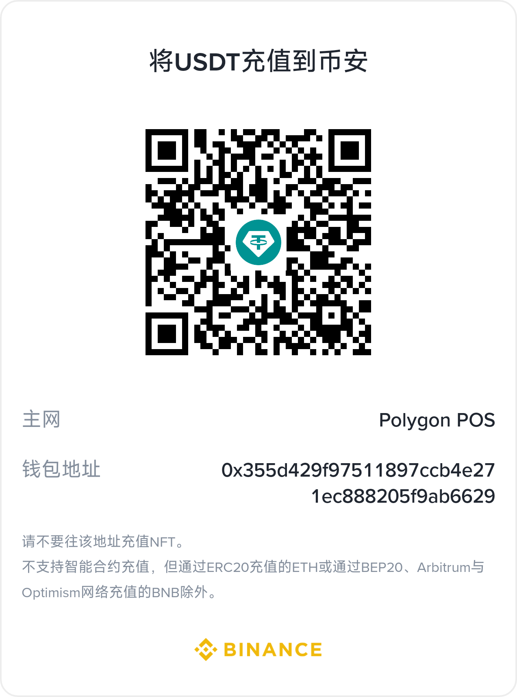

# Ads Platform — मल्टी-प्लेटफ़ॉर्म विज्ञापन प्रबंधन प्रणाली

[中文](README.md) | [English](docs/README.en.md) | [한국어](docs/README.ko.md) | [Русский](docs/README.ru.md) | [Deutsch](docs/README.de.md) | [Français](docs/README.fr.md) | [Español](docs/README.es.md) | [Português](docs/README.pt.md) | [हिन्दी](docs/README.hi.md) | [العربية](docs/README.ar.md) | [বাংলা](docs/README.bn.md) | [Bahasa Indonesia](docs/README.id.md) | [日本語](docs/README.ja.md)

Copyright (c) 2026 erik <erik@erik.xyz> — https://erik.xyz

## अवलोकन

**Ads Platform** एक मल्टी-प्लेटफ़ॉर्म विज्ञापन प्रबंधन प्रणाली है जो **29 विज्ञापन प्लेटफ़ॉर्म** (16 घरेलू + 13 अंतरराष्ट्रीय) को जोड़ती है, जिसमें विज्ञापन प्रबंधन और क्रॉस-प्लेटफ़ॉर्म डेटा रिपोर्ट का एकीकृत प्रबंधन होता है।

- **कैंपेन प्रबंधन** — OAuth खाता प्राधिकरण, कैंपेन/विज्ञापन समूह/क्रिएटिव का प्लेटफ़ॉर्म-वार एकीकृत प्रबंधन
- **रिपोर्ट** — क्रॉस-प्लेटफ़ॉर्म मेट्रिक्स एकत्रीकरण, CSV/Excel/PDF निर्यात, 5-मॉडल एट्रिब्यूशन
- **स्मार्ट डिलीवरी** — ऑटो-बिडिंग, बजट अलर्ट, कैंपेन कैलेंडर (Gantt), एसेट लाइब्रेरी
- **ग्लोबल एक्सेलरेशन** — CDN से एसेट डिलीवरी (मल्टी-ड्राइवर: लोकल / Alibaba Cloud OSS / Tencent Cloud COS / S3-कंपैटिबल, एडमिन से मल्टी-प्रोवाइडर कॉन्फ़िग)
- **मॉनिटरिंग और अलर्ट** — अलर्ट नियम इंजन, मल्टी-चैनल पुश, शेड्यूल्ड ऑटो-सिंक
- **मल्टी-एंड एक्सेस** — वेब एडमिन (Vue 3), Flutter PC/Mobile, HarmonyOS
- **स्थिरता और विश्वसनीयता** — प्लेटफ़ॉर्म कॉल सर्किट ब्रेकर/डिग्रेडेशन/टाइमआउट, 3-स्तरीय कैश, उच्च समवर्ती अनुकूलन, 22 सुरक्षा उपाय
- **अंतर्राष्ट्रीयकरण** — 12 भाषाओं में दस्तावेज़, द्विभाषी UI (ZH/EN)

> आर्किटेक्चर डिज़ाइन → [docs/architecture.hi.md](docs/architecture.hi.md)  
> फ़ंक्शन मॉड्यूल → [docs/features.hi.md](docs/features.hi.md)  
> API दस्तावेज़ → [docs/api.hi.md](docs/api.hi.md) | hg/apidoc: `http://127.0.0.1:8788/apidoc`  
> वर्शन तुलना → [docs/versions.hi.md](docs/versions.hi.md)（Lite ओपन-सोर्स / Standard & Full के लिए erik@erik.xyz से संपर्क करें）

### समर्थित प्लेटफ़ॉर्म

#### घरेलू (16)
| प्लेटफ़ॉर्म | एडाप्टर | प्रमाणीकरण |
|------|--------|------|
| 巨量引擎 | Juliang | OAuth2 Access-Token |
| 百度营销 | Baidu | OAuth2 + एनवेलप सिग्नेचर |
| 淘宝/阿里妈妈 | Taobao | OAuth2 + MD5 |
| 腾讯广告 | Tencent | OAuth2 + nonce |
| 快手磁力引擎 | Kuaishou | OAuth2 URL पैरामीटर |
| 小红书蒲公英 | Xiaohongshu | OAuth2 Bearer |
| 微博粉丝通 | Weibo | OAuth2 Bearer |
| B站花火 | Bilibili | OAuth2 Bearer |
| 优酷广告 | Youku | OAuth2 + MD5 |
| 美团广告 | Meituan | OAuth2 Bearer |
| 知乎广告 | Zhihu | OAuth2 Bearer |
| 360推广 | Qihoo360 | API Key + Sign |
| 搜狗推广 | Sogou | API Key + Sign |
| 友盟 | Umeng | API Key + MD5 |
| 京东京准通 | Jingdong | OAuth2 + MD5 |
| 拼多多广告 | Pinduoduo | OAuth2 + कस्टम Sign |

#### अंतर्राष्ट्रीय (13)
| प्लेटफ़ॉर्म | एडाप्टर | प्रमाणीकरण |
|------|--------|------|
| Google Ads | Google | OAuth2 + GAQL |
| YouTube Ads | Youtube | OAuth2 + GAQL |
| Meta Ads | Meta | OAuth2 URL पैरामीटर |
| TikTok Ads | Tiktok | OAuth2 Access-Token |
| LinkedIn Ads | Linkedin | OAuth2 Bearer |
| Snapchat Ads | Snapchat | OAuth2 Bearer |
| Pinterest Ads | Pinterest | OAuth2 Bearer |
| Twitter/X Ads | Twitter | OAuth2 Bearer |
| Amazon Ads | Amazon | OAuth2 + Profile |
| The Trade Desk | TheTradeDesk | HMAC-SHA256 |
| Spotify Ads | Spotify | OAuth2 Bearer |
| Twitch Ads | Twitch | OAuth2 Bearer + ClientId |
| Netflix Ads | Netflix | OAuth2 client_credentials |

---

## तकनीकी स्टैक

| परत | तकनीक | विवरण |
|----|------|------|
| सर्वर-साइड | webman v2 + PHP 8.2+ | 8 प्लगइन, 75+ API एंडपॉइंट |
| डेटाबेस | MySQL 8.0 | 29 टेबल, ads_ प्रीफ़िक्स, Snowflake BIGINT प्राइमरी की |
| कैश | Redis 7 | त्रि-स्तरीय कैश (L1 मेमोरी/L2 APCu/L3 Redis), रेट-लिमिट काउंटिंग, Pub/Sub, मैसेज क्यू |
| सर्च | Elasticsearch | webman-scout स्वचालित इंडेक्स सिंक (कॉन्फ़िगर किया गया) |
| एडमिन पैनल | webman-admin v2 + Vue 3 + TypeScript + Element Plus | PHP बैकएंड (पोर्ट 8789), SPA सीधे बिज़नेस API से जुड़ता है (पोर्ट 8788), 19 पेज, ECharts विज़ुअलाइज़ेशन |
| Flutter | Dart 3 + Riverpod + GoRouter + fl_chart | PC/Mobile रिस्पॉन्सिव, Desktop Shell लेआउट, 12 पेज |
| HarmonyOS | ArkTS + ArkUI | 6 पेज लागू, HTTP क्लाइंट तैयार |
| डिप्लॉयमेंट | Docker + Nginx + GHCR | Docker Compose वन-क्लिक स्टार्ट, GitHub Actions स्वचालित बिल्ड और पुश |

## आर्किटेक्चर आरेख


### अनुरोध-प्रवाह आरेख


### फ़ंक्शन मॉड्यूल आरेख


### डेटा जीवनचक्र आरेख


> पूर्ण संस्करण में सभी विस्तृत एनोटेशन, एडमिन साइड पाइपलाइन, निर्धारित कार्य गैंट चार्ट और कैश स्टेट मशीन शामिल हैं → [docs/diagrams/](docs/diagrams/) |

> विस्तृत आर्किटेक्चर विवरण, सुरक्षा आर्किटेक्चर और उच्च-समवर्ती डिज़ाइन के लिए [आर्किटेक्चर डिज़ाइन दस्तावेज़](docs/architecture.hi.md) देखें | ऐतिहासिक डिज़ाइन विनिर्देश के लिए [design.md](docs/superpowers/specs/design.hi.md) देखें

## आर्किटेक्चर विवरण

- **`service/`** — webman v2 उपयोगकर्ता-साइड बिज़नेस API सेवा, पोर्ट **8788** पर सुनती है। विज्ञापन प्लेटफ़ॉर्म एकीकरण, OAuth प्राधिकरण, डेटा सिंक, रिपोर्ट इंजन, अलर्ट मॉनिटरिंग आदि बिज़नेस लॉजिक संभालती है।
- **`admin/`** — webman-admin v2 स्वतंत्र एडमिन पैनल, पोर्ट **8789** पर सुनता है। PHP बैकएंड (प्रमाणीकरण/प्राधिकरण, उपयोगकर्ता प्रबंधन, सिस्टम कॉन्फ़िगरेशन) और Vue 3 SPA फ्रंटएंड शामिल है।
- **एडमिन पैनल और बिज़नेस सेवा के बीच संचार** — Vue SPA axios (baseURL `/api`) के माध्यम से सीधे service API से जुड़ता है; एडमिन-विशिष्ट रूट (`/api/admin/*`) एडमिन PHP बैकएंड (8789) द्वारा प्रदान किए जाते हैं, Nginx पथ के अनुसार रूटिंग करता है।
- **विकास मोड** — Vite dev server (पोर्ट 5173) `/api` को service:8788 पर प्रॉक्सी करता है; एडमिन PHP बैकएंड 8789 पर session प्रमाणीकरण और SPA स्टैटिक सेवा प्रदान करता है।
- **प्रोडक्शन मोड** — Nginx `/` को admin:8789 (एडमिन पैनल SPA) और `/api/` को service:8788 (बिज़नेस API) पर रूट करता है।

## Erik Stack एकीकरण

| पैकेज | उपयोग |
|----|------|
| `erikwang2013/snowflake-php` | वितरित Snowflake ID जनरेशन |
| `erikwang2013/hashids` | API ID पैरामीटर एन्क्रिप्शन/डिक्रिप्शन |
| `erikwang2013/jwt-webman` | JWT प्रमाणीकरण टोकन |
| `erikwang2013/encryption` | API परत पर संवेदनशील डेटा एन्क्रिप्शन/डिक्रिप्शन |
| `erikwang2013/encryptable` | DB फ़ील्ड-स्तरीय स्वचालित एन्क्रिप्शन/डिक्रिप्शन |
| `erikwang2013/webman-scout` | Elasticsearch डेटा सिंक |
| `erikwang2013/season` | देश ध्वज पहचान |
| `erikwang2013/poster-php` | स्लाइडर कैप्चा (लॉगिन सुरक्षा) |
| `hg/apidoc` | API दस्तावेज़ स्वचालित जनरेशन (एनोटेशन + Web UI) |

## अंतर्राष्ट्रीयकरण

सभी इंटरफ़ेस **चीनी (zh-CN)** / **English (en)** द्विभाषी स्विचिंग का समर्थन करते हैं:

| एंड | तकनीक | स्विचिंग विधि |
|----|------|---------|
| Admin | vue-i18n v9 | TopBar भाषा ड्रॉपडाउन मेनू, localStorage में स्थायी |
| Service API | `erik\support\I18n` | Accept-Language अनुरोध हेडर / `?lang=` पैरामीटर |
| Flutter | AppLocalizations + Delegate | सिस्टम भाषा स्वचालित पहचान |
| HarmonyOS | StringResources | `setLang()` से स्विच करें |

## सुरक्षा

### Service साइड (14 ग्लोबल परतें + AuthMiddleware)

CORS → OriginGuard → SecurityHeaders → AttackGuard → ClientPlatform → ReplayGuard → Version → RateLimit → LoginThrottle → SessionLimit → SQLGuard → Validation → ResponseTime → Encryption → AuthMiddleware（रूट परत）

### Admin साइड (10 ग्लोबल परतें + AuthCheck)

CORS → SecurityHeaders → AttackGuard → ClientPlatform → Version → RateLimit → LoginThrottle → SQLGuard → Validation → CSRF → AuthCheck（रूट परत）

### सुरक्षा क्षमता अवलोकन (22 आइटम)

| श्रेणी | सुरक्षा आइटम | विवरण |
|------|--------|------|
| इनपुट जाँच | XSS (11 पैटर्न) | script/iframe/event handler/javascript:/data: |
| | पाथ ट्रैवर्सल (7 पैटर्न) | ../ / null byte / /etc/passwd / .env / .git |
| | Header इंजेक्शन | CRLF डिटेक्शन |
| | Body आकार सीमा | 10 MiB |
| | Content-Type व्हाइटलिस्ट | JSON/Form/Multipart/Plain |
| | SQL इंजेक्शन | UNION/DROP/ALTER पैटर्न डिटेक्शन |
| प्रमाणीकरण | JWT Token बाइंडिंग | IP + User-Agent hash सत्यापन |
| | Token रिफ़्रेश + ब्लैकलिस्ट | पुराने Token स्वचालित रूप से अमान्य |
| | लॉगिन थ्रॉटलिंग | 5 असफल प्रयास → 15 मिनट लॉक (Redis) |
| | समवर्ती सत्र सीमा | प्रति उपयोगकर्ता अधिकतम 3 सक्रिय Token |
| | कैप्चा | स्लाइडर कैप्चा (5 मिनट वैध, 5px सहनशीलता) |
| अनुरोध सत्यापन | CORS व्हाइटलिस्ट | प्रोडक्शन डोमेन व्हाइटलिस्ट |
| | Origin/Referer सत्यापन | क्रॉस-ओरिजिन स्रोत जाँच |
| | CSRF Token | एडमिन साइड session token सत्यापन |
| | रिप्ले-अटैक सुरक्षा | Nonce + Timestamp ±5min (गैर-ब्राउज़र साइड) |
| | API रेट-लिमिट | स्लाइडिंग विंडो 60 बार/60s |
| | SSRF सुरक्षा | OAuth redirect_uri व्हाइटलिस्ट |
| प्रतिक्रिया हेडर | CSP | Content-Security-Policy (SPA) |
| | X-Frame-Options / HSTS | क्लिकजैकिंग सुरक्षा + HTTPS अनिवार्य |
| | X-Content-Type-Options | nosniff |
| डेटा सुरक्षा | ट्रांसमिशन एन्क्रिप्शन | EncryptionMiddleware (X-Encrypted) |
| | स्टोरेज एन्क्रिप्शन | Encryptable (DB फ़ील्ड-स्तरीय) |
| | लॉग डी-सेंसिटाइज़ेशन | password/token/secret → \*\*\* |

### सुरक्षा आर्किटेक्चर आरेख


**डिफेंस-इन-डेप्थ**: बाहरी परत (Nginx) → एंट्री गार्ड (5 मिडलवेयर परतें) → पहचान प्रमाणीकरण (7 आइटम) → इनपुट सत्यापन (4 आइटम) → फ़्रीक्वेंसी कंट्रोल → डेटा एन्क्रिप्शन → ऑडिट ट्रेस

**प्रमाणीकरण**: सर्वर-साइड और एडमिन दोनों `admin_users` टेबल + bcrypt hash का उपयोग करते हैं, JWT 24h + refresh रोटेशन

**ऑडिट**: सभी ऑपरेशन IP / User-Agent / Client-Platform / ऑपरेशन विवरण रिकॉर्ड करते हैं

**द्वितीयक पुष्टि**: डिलीट/अनबाइंड/बैच ऑपरेशन "पुष्टिकरण शब्द इनपुट" पैटर्न का उपयोग करते हैं（`GlobalConfirm` + `useConfirmStore`）

---

## उन्नत सुविधाएँ

| सुविधा | विवरण | तकनीक |
|------|------|------|
| एसेट लाइब्रेरी | छवि/वीडियो अपलोड प्रबंधन, गैलरी पूर्वावलोकन, URL कॉपी | AssetController + Vue गैलरी |
| बजट अलर्ट | दैनिक बजट खपत का रीयल-टाइम ट्रैकिंग, तीन-स्तरीय अलर्ट (50/80/100%) | BudgetAlertService + 15min Cron |
| डिलीवरी कैलेंडर | क्रॉस-प्लेटफ़ॉर्म Gantt चार्ट, मास/सप्ताह दृश्य, प्लेटफ़ॉर्म के अनुसार रंग | CalendarService + Vue Gantt |
| क्रॉस-प्लेटफ़ॉर्म एट्रिब्यूशन | 5-मॉडल एट्रिब्यूशन (first/last/linear/time_decay/position_based), 30-दिन रिट्रोस्पेक्ट | AttributionEngine + ECharts |
| प्लेटफ़ॉर्म कॉल रेज़िलिएंस | प्लेटफ़ॉर्म-वार सर्किट ब्रेकर स्टेट मशीन (5 विफलताएँ → OPEN → 30s हाफ-ओपन प्रोब), डिग्रेडेशन fast-fail, 29 एडेप्टर टाइमआउट ऑडिट | CircuitBreaker + GuardedAdapter |
| CDN एसेट एक्सेलरेशन | ऑब्जेक्ट स्टोरेज मल्टी-ड्राइवर (local/oss/cos/s3), एडमिन में CDN प्रोवाइडर मैनेजमेंट, प्रीसाइन डायरेक्ट अपलोड, डिलीट पर ऑटो कैश पर्ज | ads-storage प्लगइन + CdnProviderController |

---

## उच्च समवर्ती

| अनुकूलन | समाधान | फ़ाइल |
|------|------|------|
| DB रीड/राइट सेपरेशन | मास्टर `shared` + रीड-ओनली रेप्लिका `read_replica`, SELECT स्वचालित रूप से रेप्लिका पर रूट होता है | `config/database.php` |
| DB कनेक्शन पूल | `PDO::ATTR_PERSISTENT` पर्सिस्टेंट कनेक्शन + टाइमज़ोन इनिशियलाइज़ेशन प्रीवार्मिंग | `config/database.php` |
| Redis कनेक्शन पूल | `persistent` पर्सिस्टेंट कनेक्शन + रीड/राइट सेपरेशन `readonly` कॉन्फ़िगरेशन | `config/redis.php` |
| त्रि-स्तरीय कैश | L1 प्रोसेस मेमोरी → L2 APCu शेयर्ड मेमोरी → L3 Redis | `support/CacheService.php` |
| मैसेज क्यू एसिंक्रोनस | Redis List 4 चैनल (sync/report/export/notification) | `support/AsyncJobService.php` |
| Nginx स्तरीय रेट-लिमिट | 30r/s + burst 20 + 20 समवर्ती कनेक्शन + keepalive 32 | `docker/nginx/admin.conf` |
| क्षैतिज स्केलिंग | upstream मल्टी-इंस्टेंस + फ़ेलओवर + sticky session | `docker/nginx/admin.conf` |
| CDN एक्सेलेरेशन | स्टैटिक एसेट `expires 30d` + `immutable` + `gzip_static` | `docker/nginx/admin.conf` |

---

## त्वरित आरंभ

### वन-क्लिक Web इंस्टॉलेशन (अनुशंसित)

सेवा शुरू करने के बाद ब्राउज़र में `/install` पर जाएँ और इंस्टॉलेशन विज़ार्ड खोलें:

```bash
# 启动管理后台 (端口 8789)
cd admin && composer install && php start.php start

# 打开浏览器访问 http://localhost:8789/install
# 在安装向导中填写数据库信息、管理员账户，点击「开始安装」
```

इंस्टॉलेशन विज़ार्ड वेब पेज पर चरण-दर-चरण मार्गदर्शन करेगा:
1. **डेटाबेस कनेक्शन** — MySQL होस्ट, पोर्ट, डेटाबेस नाम, उपयोगकर्ता नाम और पासवर्ड भरें, कनेक्शन टेस्ट का समर्थन करता है
2. **Redis कॉन्फ़िगरेशन** — Redis कनेक्शन जानकारी भरें (वैकल्पिक)
3. **एडमिन खाता** — बैकएंड लॉगिन उपयोगकर्ता नाम, पासवर्ड, प्रदर्शन नाम सेट करें
4. **वन-क्लिक इंस्टॉलेशन** — स्वचालित रूप से डेटाबेस बनाता है, `install.sql` निष्पादित करके 29 टेबल बनाता है और सीड डेटा लिखता है, एडमिन पासवर्ड अपडेट करता है

इंस्टॉलेशन पूरा होने के बाद `/` पर जाकर एडमिन पैनल में प्रवेश करें, सेट किए गए उपयोगकर्ता नाम और पासवर्ड से लॉगिन करें।

### Docker (प्रोडक्शन के लिए अनुशंसित)

```bash
# 启动全部服务 (MySQL + Redis + PHP + Nginx)
docker-compose up -d

# 初始化数据库（创建表 + 种子数据）
make db-init

# 访问
# 管理后台: http://localhost
# 安装向导: http://localhost/install
# API: http://localhost/api/v1（संस्करण URL पथ में निर्धारित है, Header में नहीं भेजा जाता）
```

### स्थानीय विकास

```bash
# 服务端 (端口 8788)
cd service && composer install && php start.php start

# 管理后台 (端口 5173)
cd admin/public/web && npm install && npm run dev

# Flutter App
cd apps/flutter && flutter run -d chrome  # Web PC
# HarmonyOS App
# 使用 DevEco Studio 打开 apps/harmonyos 目录
cd apps/flutter && flutter run -d android # Mobile

# TypeScript 检查
cd admin/public/web && npx vue-tsc --noEmit   # 零错误
```

उपयोग मार्गदर्शिका → [docs/usage.hi.md](docs/usage.hi.md)
---

## प्रोजेक्ट संरचना

```
ads-php/
├── service/                           # 用户端业务服务 (webman v2 :8788)
│   ├── plugin/
│   │   ├── ads-api/                   # REST API (61 端点，版本路由)
│   │   │   ├── controller/v1/         # 17 个控制器
│   │   │   ├── middleware/            # 15 个中间件
│   │   │   ├── config/route.php       # 路由定义
│   │   ├── ads-platform/              # 平台适配器核心
│   │   │   ├── adapter/               # 29 个平台适配器
│   │   │   ├── src/                   # AdapterRegistry, CampaignData
│   │   │   ├── model/                 # BidRule, BidLog, TargetingTemplate
│   │   │   ├── service/               # BidEngine, ReportBuilder
│   │   │   └── migration/             # SQL 迁移 + 性能索引
│   │   ├── ads-account/               # OAuth 账户管理
│   │   ├── ads-task/                  # 定时任务调度 (6 cron)
│   │   ├── ads-alert/                 # 告警监控引擎 + 预算预警
│   │   ├── ads-report/                # 报表引擎 (CSV/Excel/PDF) + 归因引擎 + 投放日历
│   │   ├── ads-tenant/                # 多租户管理
│   │   └── ads-storage/               # स्टोरेज एब्स्ट्रैक्शन लेयर (local/OSS/COS/S3) + CDN प्रोवाइडर
│   ├── scripts/backfill-assets.php    # मौजूदा एसेट को ऑब्जेक्ट स्टोरेज में बैकफ़िल करें
│   ├── support/                       # Erik Stack 工具类
│   │   ├── ControllerTrait.php        # 控制器公共 trait
│   │   ├── JwtService.php             # JWT 包装类
│   │   ├── CacheService.php           # Redis 缓存服务
│   │   ├── ExceptionHandler.php       # API 异常处理器
│   │   └── ApiResponse.php            # 统一响应格式
│   ├── config/                        # 全局配置 (DB/Redis/Log/Middleware)
│   ├── tests/                         # PHPUnit 测试 (288 tests)
│   │   ├── Unit/                      # 单元测试 (Middleware, Task)
│   │   └── Integration/               # 集成测试 (Auth, Health)
│   └── start.php                      # 服务入口
├── admin/                             # 独立管理后台 (webman-admin v2 :8789)
│   ├── public/web/src/
│   │   ├── views/                     # 15 个 Vue 页面
│   │   │   ├── dashboard/             # 仪表盘 (ECharts)
│   │   │   ├── campaign/              # 广告计划
│   │   │   ├── adgroup/               # 广告组
│   │   │   ├── creative/              # 广告创意
│   │   │   ├── report/                # 报表分析 + 导出
│   │   │   ├── alert/                 # 告警规则 + 记录
│   │   │   ├── notification/          # 通知中心
│   │   │   ├── bid/                   # 自动出价规则
│   │   │   └── system/                # 用户管理 + 审计日志
│   │   ├── api/                       # 9 个 API 客户端
│   │   ├── stores/                    # 4 个 Pinia Store
│   │   └── components/                # 共享组件 (ListPageLayout 等)
│   ├── app/                           # PHP 后端 (controller/middleware)
│   └── config/                        # Admin 配置
├── apps/
│   ├── flutter/                       # Flutter Desktop App
│   │   └── lib/
│   │       ├── features/              # 12 个功能页面 + Shell 布局
│   │       ├── config/menu_config.dart # 两级菜单配置
│   │       ├── router.dart            # GoRouter (ShellRoute + 路由守卫)
│   │       └── stores/                # Riverpod Auth Provider
│   └── harmonyos/                     # HarmonyOS (API Client 就绪)
├── docker/                            # Docker & Nginx 配置
├── .github/workflows/                 # CI (语法→测试→TS→Docker) + CD (构建推送)
├── docs/                              # 设计文档、实施计划、Skills
├── docker-compose.yml
├── Dockerfile / Dockerfile.admin / Dockerfile.admin-php
└── Makefile
```

## API एंडपॉइंट

> सभी API एंडपॉइंट परिभाषाएँ [docs/api.hi.md](docs/api.hi.md) में देखें（अनुरोध/प्रतिक्रिया उदाहरण, त्रुटि कोड, रेट-लिमिट नीतियाँ सहित）。
> hg/apidoc ऑनलाइन दस्तावेज़: सेवा शुरू करने के बाद `http://127.0.0.1:8788/apidoc` पर जाएँ

## डेटाबेस

**नामकरण मानक**: टेबल प्रीफ़िक्स `ads_`, प्राइमरी की `BIGINT UNSIGNED PRIMARY KEY`（बिना auto-increment, Snowflake ID）, इंजन InnoDB, कैरेक्टर सेट utf8mb4

| श्रेणी | टेबल नाम | उपयोग |
|------|------|------|
| बेसिक | `ads_tenants` | मल्टी-टेनेंट |
| खाता | `ads_platform_accounts`, `ads_auth_tokens` | OAuth प्लेटफ़ॉर्म खाते |
| डिलीवरी | `ads_campaigns`, `ads_ad_groups`, `ads_creatives` | विज्ञापन डिलीवरी पदानुक्रम |
| रिपोर्ट | `ads_report_metrics`, `ads_report_extras` | एकीकृत रिपोर्ट मेट्रिक्स |
| एसेट | `ads_assets` | क्रिएटिव एसेट लाइब्रेरी |
| CDN | `ads_cdn_providers` | CDN प्रोवाइडर कॉन्फ़िग (क्रेडेंशियल एन्क्रिप्टेड) |
| टार्गेटिंग | `ads_targeting_templates` | ऑडियंस टार्गेटिंग टेम्पलेट |
| एट्रिब्यूशन | `ads_conversions`, `ads_attribution_results` | कन्वर्ज़न ट्रैकिंग + एट्रिब्यूशन परिणाम |
| बिडिंग | `ads_bid_rules`, `ads_bid_logs` | स्वचालित बिडिंग नियम + इतिहास |
| अलर्ट | `ads_alert_rules`, `ads_alert_logs` | अलर्ट मॉनिटरिंग |
| नोटिफिकेशन | `ads_notifications` | साइट-इन नोटिफिकेशन |
| सिस्टम | `ads_sync_errors`, `admin_users`, `admin_roles`, `admin_audit_logs` | सिंक त्रुटियाँ, RBAC, ऑडिट |

---

## निर्धारित कार्य

| कार्य | आवृत्ति | फ़ंक्शन |
|------|------|------|
| TokenRefreshTask | हर 55 मिनट | समाप्त होने वाले OAuth Token स्कैन करें, स्वचालित रूप से रिफ़्रेश करें |
| DataSyncTask | हर 10 मिनट | प्रत्येक प्लेटफ़ॉर्म के अभियान+विज्ञापन समूह+क्रिएटिव+रिपोर्ट प्राप्त करें, एकीकृत टेबल में लिखें, कैश साफ़ करें |
| AlertCheckTask | हर 5 मिनट | सक्षम अलर्ट नियमों को स्कैन करें, थ्रेशोल्ड का मूल्यांकन करें, पुश ट्रिगर करें |
| BidCheckTask | हर 10 मिनट | स्वचालित बिडिंग नियमों को स्कैन करें, मेट्रिक्स क्वेरी करें, बजट समायोजन/स्टार्ट-स्टॉप निष्पादित करें |
| BudgetCheckTask | हर 15 मिनट | चालू अभियानों को स्कैन करें, दैनिक बजट खपत ट्रैक करें, तीन-स्तरीय अलर्ट (50/80/100%) |
| RetrySyncTask | हर 3 मिनट | असफल सिंक कार्यों को पुनः प्रयास करें (अधिकतम 3 बार, एक्सपोनेंशियल बैकऑफ़) |

---

## परीक्षण

```bash
cd service && ./vendor/bin/phpunit
# 288 测试 / 862 断言
```

**कवरेज**: 14 मिडलवेयर · 8 प्लगइन बिज़नेस लेयर (अकाउंट/अलर्ट/प्लेटफ़ॉर्म/रिपोर्ट/टास्क/टेनेंट/स्टोरेज) · इंजन (Bid/Alert/Attribution/Report) · API इंटीग्रेशन टेस्ट (76 रूट्स) · UI E2E (18 पेज)

```bash
# TypeScript 检查
cd admin/public/web && npx vue-tsc --noEmit   # 零错误

# Dart 分析
cd apps/flutter && dart analyze   # 零错误
```

## CI/CD

**CI** (`.github/workflows/ci.yml`): स्वचालित पाइपलाइन — **PHP Syntax → PHPUnit → TypeScript → Docker Build**

**CD** (`.github/workflows/deploy.yml`): मैनुअल ट्रिगर — **Docker Buildx → GHCR पुश (service/admin/admin-php) → डिप्लॉयमेंट नोटिफिकेशन**

`.github/dependabot.yml` हर सप्ताह Composer + npm + Docker डिपेंडेंसी को स्वचालित रूप से अपडेट करता है।

---

## Skills

`docs/skills/` — 11 पुन: प्रयोज्य प्रोजेक्ट स्किल्स:

| Skill | विवरण |
|------|------|
| `adapter-generator` | नया विज्ञापन प्लेटफ़ॉर्म एडाप्टर जनरेट करें (14-मेथड टेम्पलेट) |
| `migration-generator` | SQL माइग्रेशन फ़ाइलें जनरेट करें (ads_ प्रीफ़िक्स + BIGINT PK) |
| `erik-stack` | Erik Stack 8 पैकेज एकीकरण उपयोग गाइड |
| `admin-page-generator` | Vue3 एडमिन पैनल पेज जनरेट करें |
| `api-endpoint` | RESTful API एंडपॉइंट जोड़ें |
| `tdd-workflow` | TDD सत्यापन प्रक्रिया (टेस्ट→इम्प्लीमेंटेशन→सिंटैक्स→TypeScript→कमिट) |
| `security-middleware` | सुरक्षा मिडलवेयर परतें जोड़ें (इंटरफ़ेस विनिर्देश + पंजीकरण + मौजूदा चेन संदर्भ) |
| `version-split` | Lite/Standard/Full तीन-वर्शन स्प्लिट (ऑपरेशन चरण + कॉन्फ़िगरेशन अपडेट) |
| `cache-strategy` | त्रि-स्तरीय कैश रणनीति (L1 मेमोरी/L2 APCu/L3 Redis + TTL सुझाव) |
| `attribution-setup` | क्रॉस-प्लेटफ़ॉर्म एट्रिब्यूशन इंजन (5 मॉडल + API कॉल + डेटा तैयारी) |
| `high-concurrency` | उच्च समवर्ती 8 अनुकूलन (रीड/राइट सेपरेशन/कनेक्शन पूल/मैसेज क्यू/क्षैतिज स्केलिंग/CDN) |


## ओपन-सोर्स आसान नहीं है, समर्थन का स्वागत है

| वीचैट | अलीपे |
|:---:|:---:|
|  |  |

### 全球转账打赏 (Global Transfer Donation)

**收款人信息 (Beneficiary)**

| 字段 | 值 |
|------|-----|
| 收款人姓名 (Name) | WANG KEXUN |
| 收款账户号码 (Account No.) | 881015918251 |

**收款银行 (Receiving Bank) — ZA Bank**

| 字段 | 值 |
|------|-----|
| SWIFT Code | AABLHKHHXXX |
| 银行名称 (Bank Name) | ZA Bank Limited |
| 银行编号 (Bank Code) | 387 |
| 银行地址 (Bank Address) | Core F, Cyberport 3, 100 Cyberport Road, Hong Kong |

> **跨境汇款代理银行（如需，Correspondent Bank）**：यह एजेंट (ट्रांज़िट) बैंक की जानकारी है, प्राप्तकर्ता बैंक की नहीं; कृपया अपने रेमिटेंस बैंक से पूछें कि क्या इस जानकारी की आवश्यकता है।
>
> - **港元、人民币及美元**：Citibank N.A. Hong Kong — SWIFT `CITIHKHXXXX` · 银行编号 006 · Hong Kong Branch（分行编号 391）· Citibank Tower, Citibank Plaza, 3 Garden Road, Central, Hong Kong
> - **其他币种**：THE BANK OF NEW YORK MELLON — SWIFT `IRVTUS3NXXX` · 240 GREENWICH STREET, NEW YORK, United States

### क्रिप्टो दान (Crypto Donation)

यदि यह प्रोजेक्ट आपके काम आए, तो दान करने के लिए QR कोड स्कैन करें, धन्यवाद!

| नेटवर्क (Network) | QR कोड (QR Code) | वॉलेट पता (Wallet Address) |
|---|---|---|
| BNB Smart Chain (BEP20) | [](./coin/1.jpg) | `0x355d429f97511897ccb4e271ec888205f9ab6629` |
| Tron (TRC20) | [](./coin/2.jpg) | `TEdDHWLajt1XvqtPDWmQctdrJaC3pzZZzz` |
| Ethereum (ERC20) | [](./coin/3.jpg) | `0x355d429f97511897ccb4e271ec888205f9ab6629` |
| Aptos | [](./coin/4.jpg) | `0x836e3780edfc3f7b2372b39e2a1a3a5d7adfaccd96c726f21cfde1b50dd68030` |
| Plasma | [](./coin/5.jpg) | `0x355d429f97511897ccb4e271ec888205f9ab6629` |
| Polygon POS | [](./coin/6.jpg) | `0x355d429f97511897ccb4e271ec888205f9ab6629` |
| Solana | [](./coin/7.jpg) | `2hfhboHdmdrYsY25XfQSsEWxq5ip4EQsR7f4AzSRMUyr` |
| The Open Network (TON) | [](./coin/8.jpg) | `UQB9kFQohzmXUir9QSSZq01iwl9aQZIDdBpNmDklljRtCoGK` |
| Arbitrum One | [](./coin/9.jpg) | `0x355d429f97511897ccb4e271ec888205f9ab6629` |
| AVAX C-Chain | [](./coin/10.jpg) | `0x355d429f97511897ccb4e271ec888205f9ab6629` |

---

## लाइसेंस

Copyright (c) 2026 erik <erik@erik.xyz> — https://erik.xyz

All rights reserved.
