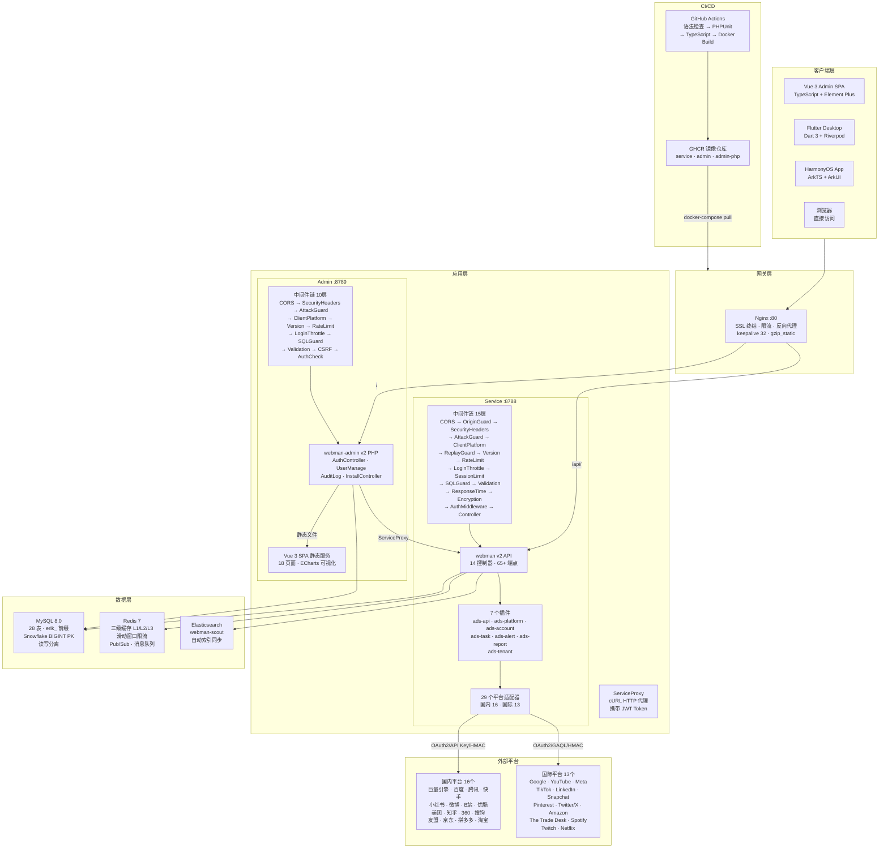

# 系统架构图

Copyright (c) 2026 erik <erik@erik.xyz> — https://erik.xyz

```mermaid
graph TB
    subgraph Clients["客户端层"]
        Vue["Vue 3 Admin SPA<br/>TypeScript + Element Plus"]
        Flutter["Flutter Desktop<br/>Dart 3 + Riverpod"]
        Harmony["HarmonyOS App<br/>ArkTS + ArkUI"]
        Browser["浏览器<br/>直接访问"]
    end

    subgraph Gateway["网关层"]
        Nginx["Nginx :80<br/>SSL 终结 · 限流 · 反向代理<br/>keepalive 32 · gzip_static"]
    end

    subgraph AppLayer["应用层"]
        subgraph Admin["Admin :8789"]
            AdminPHP["webman-admin v2 PHP<br/>AuthController · UserManage<br/>AuditLog · InstallController"]
            AdminSPA["Vue 3 SPA 静态服务<br/>18 页面 · ECharts 可视化"]
            AdminMW["中间件链 10层<br/>CORS → SecurityHeaders → AttackGuard<br/>→ ClientPlatform → Version → RateLimit<br/>→ LoginThrottle → SQLGuard<br/>→ Validation → CSRF → AuthCheck"]
        end

        subgraph Service["Service :8788"]
            ServiceAPI["webman v2 API<br/>14 控制器 · 65+ 端点"]
            Plugins["7 个插件<br/>ads-api · ads-platform · ads-account<br/>ads-task · ads-alert · ads-report<br/>ads-tenant"]
            Adapters["29 个平台适配器<br/>国内 16 · 国际 13"]
            ServiceMW["中间件链 15层<br/>CORS → OriginGuard → SecurityHeaders<br/>→ AttackGuard → ClientPlatform<br/>→ ReplayGuard → Version → RateLimit<br/>→ LoginThrottle → SessionLimit<br/>→ SQLGuard → Validation<br/>→ ResponseTime → Encryption<br/>→ AuthMiddleware → Controller"]
        end

        ServiceProxy["ServiceProxy<br/>cURL HTTP 代理<br/>携带 JWT Token"]
    end

    subgraph DataLayer["数据层"]
        MySQL["MySQL 8.0<br/>28 表 · erik_ 前缀<br/>Snowflake BIGINT PK<br/>读写分离"]
        Redis["Redis 7<br/>三级缓存 L1/L2/L3<br/>滑动窗口限流<br/>Pub/Sub · 消息队列"]
        ES["Elasticsearch<br/>webman-scout<br/>自动索引同步"]
    end

    subgraph External["外部平台"]
        Domestic["国内平台 16个<br/>巨量引擎 · 百度 · 腾讯 · 快手<br/>小红书 · 微博 · B站 · 优酷<br/>美团 · 知乎 · 360 · 搜狗<br/>友盟 · 京东 · 拼多多 · 淘宝"]
        International["国际平台 13个<br/>Google · YouTube · Meta<br/>TikTok · LinkedIn · Snapchat<br/>Pinterest · Twitter/X · Amazon<br/>The Trade Desk · Spotify<br/>Twitch · Netflix"]
    end

    subgraph CICD["CI/CD"]
        GHA["GitHub Actions<br/>语法检查 → PHPUnit<br/>→ TypeScript → Docker Build"]
        GHCR["GHCR 镜像仓库<br/>service · admin · admin-php"]
    end

    Clients --> Nginx
    Nginx -->|"/"| AdminPHP
    Nginx -->|"/api/"| ServiceAPI
    AdminPHP -->|"静态文件"| AdminSPA
    AdminMW --> AdminPHP
    ServiceMW --> ServiceAPI
    AdminPHP -->|"ServiceProxy"| ServiceAPI
    ServiceAPI --> Plugins
    Plugins --> Adapters
    Adapters -->|"OAuth2/API Key/HMAC"| Domestic
    Adapters -->|"OAuth2/GAQL/HMAC"| International
    ServiceAPI --> MySQL
    ServiceAPI --> Redis
    ServiceAPI --> ES
    AdminPHP --> MySQL
    GHA --> GHCR
    GHCR -->|"docker-compose pull"| Gateway
```
