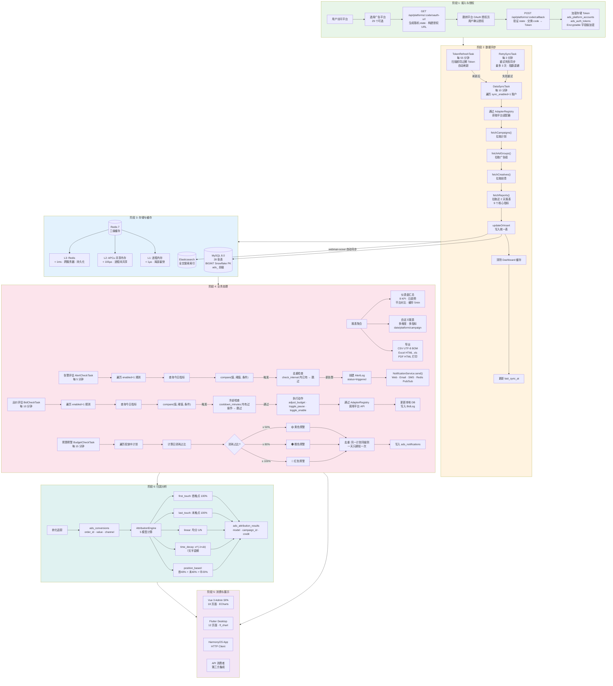
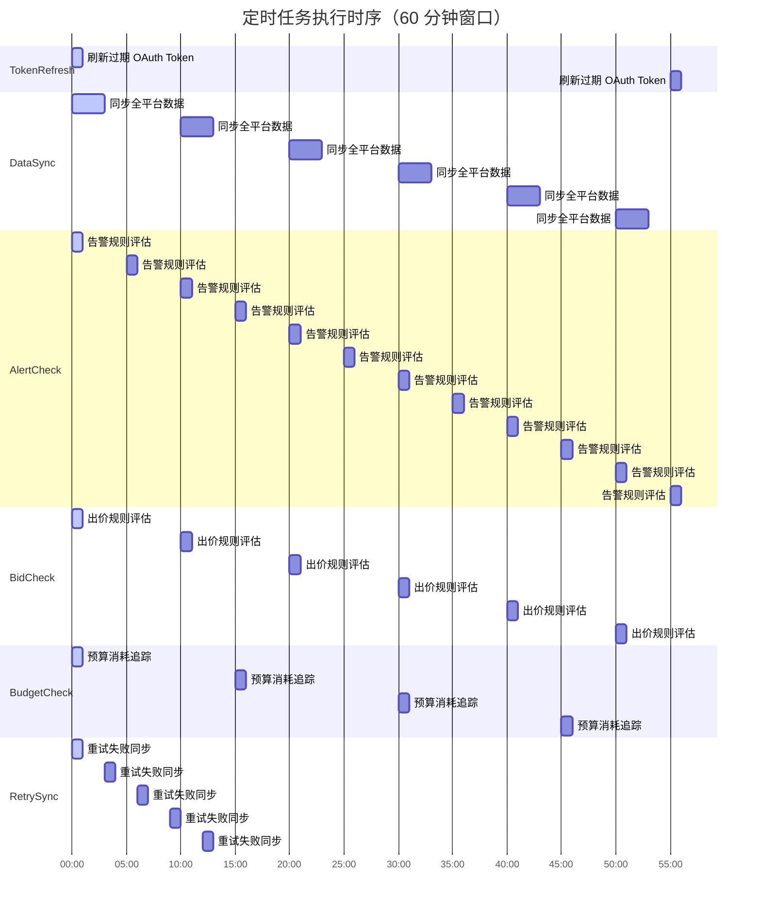
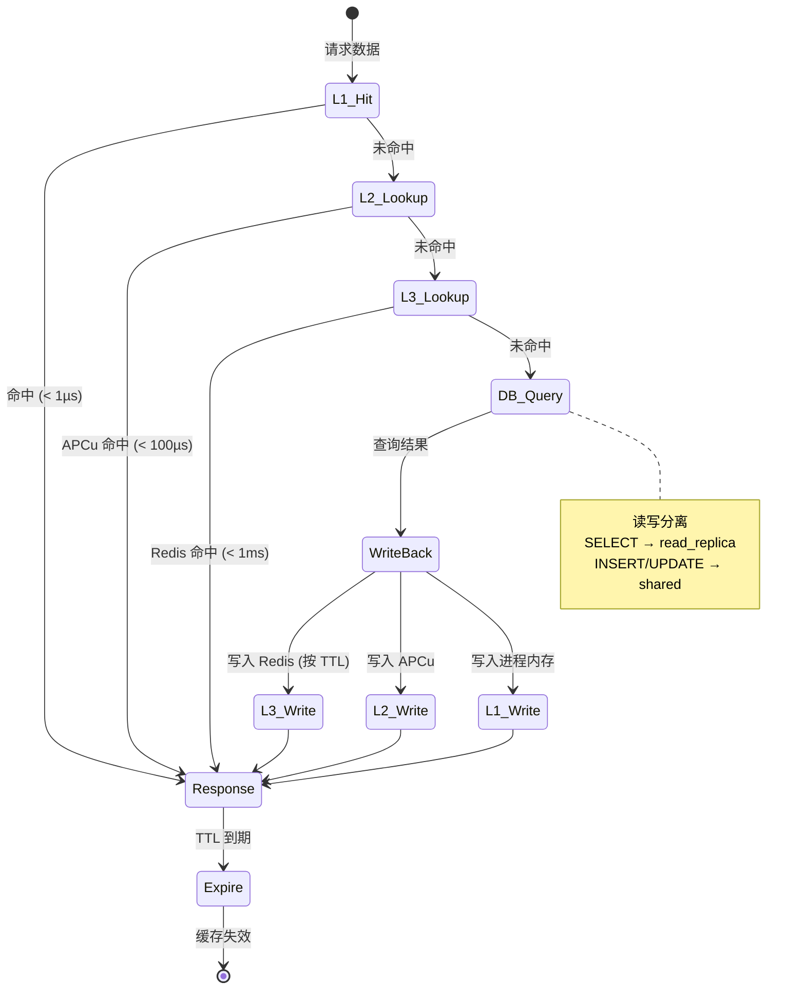

# 数据生命周期图

Copyright (c) 2026 erik <erik@erik.xyz> — https://erik.xyz

## 广告数据完整生命周期

```mermaid
flowchart TD
    subgraph Phase1["阶段 1: 接入与授权"]
        A1["用户访问平台"] --> A2["选择广告平台<br/>29 个可选"]
        A2 --> A3["GET /api/platforms/:code/oauth-url<br/>生成随机 state · 构建授权 URL"]
        A3 --> A4["跳转平台 OAuth 授权页<br/>用户确认授权"]
        A4 --> A5["POST /api/platforms/:code/callback<br/>验证 state · 交换 code → Token"]
        A5 --> A6["加密存储 Token<br/>ads_platform_accounts<br/>ads_auth_tokens<br/>Encryptable 字段级加密"]
    end

    subgraph Phase2["阶段 2: 数据同步"]
        B1["TokenRefreshTask<br/>每 55 分钟<br/>扫描即将过期 Token<br/>自动刷新"]
        B2["DataSyncTask<br/>每 10 分钟<br/>遍历 sync_enabled=1 账户"]
        B3["RetrySyncTask<br/>每 3 分钟<br/>重试失败同步<br/>最多 3 次 · 指数退避"]

        B1 -->|"刷新后"| B2
        B2 --> C1["通过 AdapterRegistry<br/>获取平台适配器"]
        C1 --> C2["fetchCampaigns()<br/>拉取计划"]
        C2 --> C3["fetchAdGroups()<br/>拉取广告组"]
        C3 --> C4["fetchCreatives()<br/>拉取创意"]
        C4 --> C5["fetchReports()<br/>拉取近 2 天报表<br/>9 个核心指标"]
        C5 --> C6["updateOrInsert<br/>写入统一表"]
        C6 --> C7["清除 Dashboard 缓存"]
        C7 --> C8["更新 last_sync_at"]
        B3 -->|"失败重试"| B2
    end

    subgraph Phase3["阶段 3: 存储与缓存"]
        D1[("MySQL 8.0<br/>28 张表<br/>BIGINT Snowflake PK<br/>ads_ 前缀")]
        D2[("Redis 7<br/>三级缓存")]
        D3[("Elasticsearch<br/>全文搜索索引")]

        D2 --> D2L1["L1: 进程内存<br/>< 1µs · 局部最快"]
        D2 --> D2L2["L2: APCu 共享内存<br/>< 100µs · 进程间共享"]
        D2 --> D2L3["L3: Redis<br/>< 1ms · 跨服务器 · 持久化"]

        C6 --> D1
        C6 -->|"webman-scout 自动同步"| D3
    end

    subgraph Phase4["阶段 4: 业务处理"]
        E1["报表聚合"] --> E1A["仪表盘汇总<br/>8 KPI · 日趋势<br/>平台对比 · 缓存 5min"]
        E1 --> E1B["自定义报表<br/>多维度 · 多指标<br/>date/platform/campaign"]
        E1 --> E1C["导出<br/>CSV UTF-8 BOM<br/>Excel HTML .xls<br/>PDF HTML 打印"]

        E2["告警评估 AlertCheckTask<br/>每 5 分钟"] --> E2A["遍历 enabled=1 规则"]
        E2A --> E2B["查询今日指标"]
        E2B --> E2C["compare(值, 阈值, 条件)"]
        E2C -->|"触发"| E2D["去重检查<br/>check_interval 内已有 → 跳过"]
        E2D -->|"新告警"| E2E["创建 AlertLog<br/>status=triggered"]
        E2E --> E2F["NotificationService.send()<br/>Web · Email · SMS · Redis Pub/Sub"]

        E3["出价评估 BidCheckTask<br/>每 10 分钟"] --> E3A["遍历 enabled=1 规则"]
        E3A --> E3B["查询今日指标"]
        E3B --> E3C["compare(值, 阈值, 条件)"]
        E3C -->|"触发"| E3D["冷却检查<br/>cooldown_minutes 内有过操作 → 跳过"]
        E3D -->|"通过"| E3E["执行动作<br/>adjust_budget · toggle_pause · toggle_enable"]
        E3E --> E3F["通过 AdapterRegistry<br/>调用平台 API"]
        E3F --> E3G["更新本地 DB<br/>写入 BidLog"]

        E4["预算预警 BudgetCheckTask<br/>每 15 分钟"] --> E4A["遍历投放中计划"]
        E4A --> E4B["计算日消耗占比"]
        E4B --> E4C{"消耗占比?"}
        E4C -->|"≥ 50%"| E4D["🟡 黄色预警"]
        E4C -->|"≥ 80%"| E4E["🟠 橙色预警"]
        E4C -->|"≥ 100%"| E4F["🔴 红色预警"]
        E4D & E4E & E4F --> E4G["去重: 同一计划同级别<br/>一天只通知一次"]
        E4G --> E4H["写入 ads_notifications"]
    end

    subgraph Phase5["阶段 5: 消费与展示"]
        F1["Vue 3 Admin SPA<br/>18 页面 · ECharts"]
        F2["Flutter Desktop<br/>12 页面 · fl_chart"]
        F3["HarmonyOS App<br/>HTTP Client"]
        F4["API 消费者<br/>第三方集成"]
    end

    subgraph Phase6["阶段 6: 归因分析"]
        G1["转化追踪"] --> G1A["ads_conversions<br/>order_id · value · channel"]
        G1A --> G2["AttributionEngine<br/>5 模型计算"]
        G2 --> G2A["first_touch: 首触点 100%"]
        G2 --> G2B["last_touch: 末触点 100%"]
        G2 --> G2C["linear: 均分 1/N"]
        G2 --> G2D["time_decay: e^(-λ×Δt)<br/>7天半衰期"]
        G2 --> G2E["position_based:<br/>首40% + 末40% + 中20%"]
        G2A & G2B & G2C & G2D & G2E --> G3["ads_attribution_results<br/>model · campaign_id · credit"]
    end

    Phase1 --> Phase2
    Phase2 --> Phase3
    Phase3 --> Phase4
    Phase4 --> Phase5
    Phase4 --> Phase6
    Phase6 --> Phase5

    style Phase1 fill:#e8f5e9
    style Phase2 fill:#fff3e0
    style Phase3 fill:#e3f2fd
    style Phase4 fill:#fce4ec
    style Phase5 fill:#f3e5f5
    style Phase6 fill:#e0f2f1
```

## 定时任务编排时序

```mermaid
gantt
    title 定时任务执行时序（60 分钟窗口）
    dateFormat  mm:ss
    axisFormat  %M:%S

    section TokenRefresh
    刷新过期 OAuth Token     :active, tok1, 00:00, 1m
    刷新过期 OAuth Token     :tok2, 55:00, 1m

    section DataSync
    同步全平台数据           :active, ds1, 00:00, 3m
    同步全平台数据           :ds2, 10:00, 3m
    同步全平台数据           :ds3, 20:00, 3m
    同步全平台数据           :ds4, 30:00, 3m
    同步全平台数据           :ds5, 40:00, 3m
    同步全平台数据           :ds6, 50:00, 3m

    section AlertCheck
    告警规则评估             :active, ac1, 00:00, 1m
    告警规则评估             :ac2, 05:00, 1m
    告警规则评估             :ac3, 10:00, 1m
    告警规则评估             :ac4, 15:00, 1m
    告警规则评估             :ac5, 20:00, 1m
    告警规则评估             :ac6, 25:00, 1m
    告警规则评估             :ac7, 30:00, 1m
    告警规则评估             :ac8, 35:00, 1m
    告警规则评估             :ac9, 40:00, 1m
    告警规则评估             :ac10, 45:00, 1m
    告警规则评估             :ac11, 50:00, 1m
    告警规则评估             :ac12, 55:00, 1m

    section BidCheck
    出价规则评估             :active, bc1, 00:00, 1m
    出价规则评估             :bc2, 10:00, 1m
    出价规则评估             :bc3, 20:00, 1m
    出价规则评估             :bc4, 30:00, 1m
    出价规则评估             :bc5, 40:00, 1m
    出价规则评估             :bc6, 50:00, 1m

    section BudgetCheck
    预算消耗追踪             :active, bg1, 00:00, 1m
    预算消耗追踪             :bg2, 15:00, 1m
    预算消耗追踪             :bg3, 30:00, 1m
    预算消耗追踪             :bg4, 45:00, 1m

    section RetrySync
    重试失败同步             :active, rs1, 00:00, 1m
    重试失败同步             :rs2, 03:00, 1m
    重试失败同步             :rs3, 06:00, 1m
    重试失败同步             :rs4, 09:00, 1m
    重试失败同步             :rs5, 12:00, 1m
```

## 缓存生命周期

```mermaid
stateDiagram-v2
    [*] --> L1_Hit: 请求数据
    L1_Hit --> Response: 命中 (< 1µs)
    L1_Hit --> L2_Lookup: 未命中

    L2_Lookup --> Response: APCu 命中 (< 100µs)
    L2_Lookup --> L3_Lookup: 未命中

    L3_Lookup --> Response: Redis 命中 (< 1ms)
    L3_Lookup --> DB_Query: 未命中

    DB_Query --> WriteBack: 查询结果
    WriteBack --> L3_Write: 写入 Redis (按 TTL)
    WriteBack --> L2_Write: 写入 APCu
    WriteBack --> L1_Write: 写入进程内存
    L3_Write --> Response
    L2_Write --> Response
    L1_Write --> Response

    Response --> Expire: TTL 到期
    Expire --> [*]: 缓存失效

    note right of DB_Query: 读写分离<br/>SELECT → read_replica<br/>INSERT/UPDATE → shared
```
