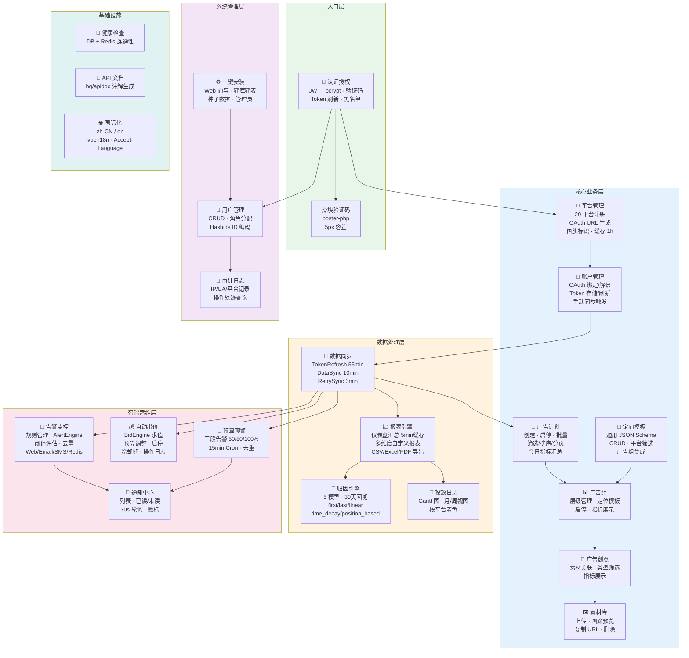
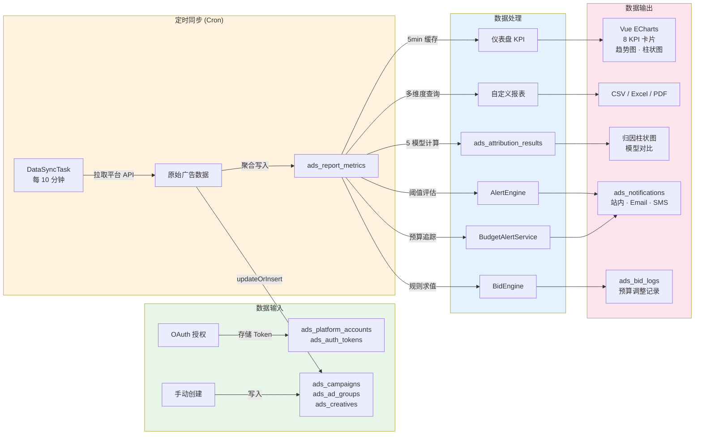

# 功能模块图

Copyright (c) 2026 erik <erik@erik.xyz> — https://erik.xyz

## 模块总览与依赖关系

```mermaid
graph TB
    subgraph Entry["入口层"]
        Auth["🔐 认证授权<br/>JWT · bcrypt · 验证码<br/>Token 刷新 · 黑名单"]
        Captcha["滑块验证码<br/>poster-php<br/>5px 容差"]
    end

    subgraph Core["核心业务层"]
        Platform["📡 平台管理<br/>29 平台注册<br/>OAuth URL 生成<br/>国旗标识 · 缓存 1h"]
        Account["🔗 账户管理<br/>OAuth 绑定/解绑<br/>Token 存储/刷新<br/>手动同步触发"]
        Campaign["📢 广告计划<br/>创建 · 启停 · 批量<br/>筛选/排序/分页<br/>今日指标汇总"]
        AdGroup["📊 广告组<br/>层级管理 · 定位模板<br/>启停 · 指标展示"]
        Creative["🎨 广告创意<br/>素材关联 · 类型筛选<br/>指标展示"]
        Asset["🖼️ 素材库<br/>上传 · 画廊预览<br/>复制 URL · 删除"]
        Targeting["🎯 定向模板<br/>通用 JSON Schema<br/>CRUD · 平台筛选<br/>广告组集成"]
    end

    subgraph Data["数据处理层"]
        Sync["🔄 数据同步<br/>TokenRefresh 55min<br/>DataSync 10min<br/>RetrySync 3min"]
        Report["📈 报表引擎<br/>仪表盘汇总 5min缓存<br/>多维度自定义报表<br/>CSV/Excel/PDF 导出"]
        Attribution["📐 归因引擎<br/>5 模型 · 30天回溯<br/>first/last/linear<br/>time_decay/position_based"]
        Calendar["📅 投放日历<br/>Gantt 图 · 月/周视图<br/>按平台着色"]
    end

    subgraph Intelligence["智能运维层"]
        Alert["🚨 告警监控<br/>规则管理 · AlertEngine<br/>阈值评估 · 去重<br/>Web/Email/SMS/Redis"]
        Notification["🔔 通知中心<br/>列表 · 已读/未读<br/>30s 轮询 · 徽标"]
        Bid["💰 自动出价<br/>BidEngine 求值<br/>预算调整 · 启停<br/>冷却期 · 操作日志"]
        Budget["💸 预算预警<br/>三段告警 50/80/100%<br/>15min Cron · 去重"]
    end

    subgraph Admin["系统管理层"]
        UserMgmt["👥 用户管理<br/>CRUD · 角色分配<br/>Hashids ID 编码"]
        Audit["📝 审计日志<br/>IP/UA/平台记录<br/>操作轨迹查询"]
        Install["⚙️ 一键安装<br/>Web 向导 · 建库建表<br/>种子数据 · 管理员"]
    end

    subgraph Infra["基础设施"]
        Health["💚 健康检查<br/>DB + Redis 连通性"]
        Doc["📖 API 文档<br/>hg/apidoc 注解生成"]
        I18n["🌐 国际化<br/>zh-CN / en<br/>vue-i18n · Accept-Language"]
    end

    Auth --> Captcha
    Auth --> Platform
    Platform --> Account
    Account --> Sync
    Sync --> Campaign
    Campaign --> AdGroup
    AdGroup --> Creative
    Creative --> Asset
    Targeting --> AdGroup
    Sync --> Report
    Report --> Attribution
    Report --> Calendar
    Sync --> Alert
    Alert --> Notification
    Sync --> Bid
    Sync --> Budget
    Budget --> Notification
    Auth --> UserMgmt
    UserMgmt --> Audit
    Install --> UserMgmt

    style Entry fill:#e8f5e9
    style Core fill:#e3f2fd
    style Data fill:#fff3e0
    style Intelligence fill:#fce4ec
    style Admin fill:#f3e5f5
    style Infra fill:#e0f2f1
```

## 数据流向图

```mermaid
flowchart LR
    subgraph Input["数据输入"]
        OAuth["OAuth 授权"] -->|"存储 Token"| DB["ads_platform_accounts<br/>ads_auth_tokens"]
        Manual["手动创建"] -->|"写入"| Campaigns["ads_campaigns<br/>ads_ad_groups<br/>ads_creatives"]
    end

    subgraph Sync2["定时同步 (Cron)"]
        Cron["DataSyncTask<br/>每 10 分钟"] -->|"拉取平台 API"| Raw["原始广告数据"]
        Raw -->|"updateOrInsert"| Campaigns
        Raw -->|"聚合写入"| Metrics["ads_report_metrics"]
    end

    subgraph Process["数据处理"]
        Metrics -->|"5min 缓存"| Dashboard["仪表盘 KPI"]
        Metrics -->|"多维度查询"| CustomReport["自定义报表"]
        Metrics -->|"5 模型计算"| AttributionResult["ads_attribution_results"]
        Metrics -->|"阈值评估"| AlertEngine["AlertEngine"]
        Metrics -->|"规则求值"| BidEngine["BidEngine"]
        Metrics -->|"预算追踪"| BudgetAlert["BudgetAlertService"]
    end

    subgraph Output["数据输出"]
        Dashboard --> Vue["Vue ECharts<br/>8 KPI 卡片<br/>趋势图 · 柱状图"]
        CustomReport --> Export["CSV / Excel / PDF"]
        AttributionResult --> AttributionChart["归因柱状图<br/>模型对比"]
        AlertEngine --> Notifications["ads_notifications<br/>站内 · Email · SMS"]
        BidEngine --> BidLogs["ads_bid_logs<br/>预算调整记录"]
        BudgetAlert --> Notifications
    end

    style Input fill:#e8f5e9
    style Sync2 fill:#fff3e0
    style Process fill:#e3f2fd
    style Output fill:#fce4ec
```
