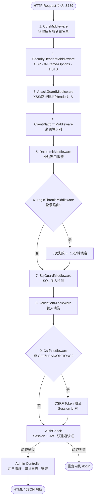
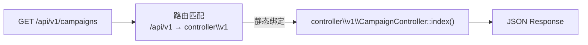

# 请求流程图

Copyright (c) 2026 erik <erik@erik.xyz> — https://erik.xyz

## Service 端请求管道（14 层中间件）

```mermaid
flowchart TD
    Start(["HTTP Request 到达 :8788"]) --> CORS["1. CorsMiddleware<br/>CORS 白名单验证<br/>OPTIONS 预检响应"]
    CORS --> Origin["2. OriginGuardMiddleware<br/>Origin/Referer 校验<br/>拦截 TRACE/DEBUG/CONNECT"]
    Origin --> SecHeaders["3. SecurityHeadersMiddleware<br/>CSP · X-Frame-Options<br/>X-Content-Type-Options · HSTS"]
    SecHeaders --> Attack["4. AttackGuardMiddleware<br/>XSS 11模式检测<br/>路径遍历 7模式检测<br/>Header CRLF 注入检测<br/>Body 大小限制 10MiB<br/>Content-Type 白名单"]
    Attack --> Client["5. ClientPlatformMiddleware<br/>8 端来源识别<br/>web/ios/android/ipados<br/>macos/windows/linux/harmonyos"]
    Client --> Replay["6. ReplayGuardMiddleware<br/>Nonce + Timestamp 防重放<br/>±5min 时间窗口<br/>非浏览器端强校验"]
    Replay --> RateLimit["7. RateLimitMiddleware<br/>Redis 滑动窗口<br/>60次/60s 全局限流"]
    RateLimit --> LoginThrottle{"8. LoginThrottleMiddleware<br/>是否为登录路由?"}
    LoginThrottle -->|"是"| ThrottleCheck["5次失败 → 15分钟锁定<br/>Redis 计数 + TTL"]
    LoginThrottle -->|"否"| SessionLimit["9. SessionLimitMiddleware<br/>并发会话限制<br/>每用户最大 3 个活跃 Token"]
    ThrottleCheck --> SessionLimit
    SessionLimit --> SQLGuard["10. SqlGuardMiddleware<br/>SQL 注入模式检测<br/>UNION/DROP/ALTER/SLEEP"]
    SQLGuard --> Validation["11. ValidationMiddleware<br/>输入清洗<br/>trim + strip_tags"]
    Validation --> RespTime["12. ResponseTimeMiddleware<br/>记录 X-Response-Time<br/>慢请求日志 (>1s)"]
    RespTime --> Encryption{"13. EncryptionMiddleware<br/>X-Encrypted 头?"}
    Encryption -->|"是"| Decrypt["AES 解密请求 Body<br/>处理后 AES 加密响应"]
    Encryption -->|"否"| Auth["14. AuthMiddleware<br/>JWT Bearer Token 验证<br/>IP + User-Agent 绑定校验<br/>Token 黑名单检查"]
    Decrypt --> Auth
    Auth -->|"验证通过"| Controller["Controller 业务处理<br/>14 个控制器"]
    Auth -->|"验证失败"| Err401(["401 Unauthorized"])
    Controller --> Response(["JSON Response<br/>{ code, message, data }"])
```

## Admin 端请求管道（9 层中间件）

## 版本路由机制

API 版本号固定在 URL 路径中（`/api/v1/...`），路由静态绑定到 `controller\v1\*`，不在 Header 中传递。

