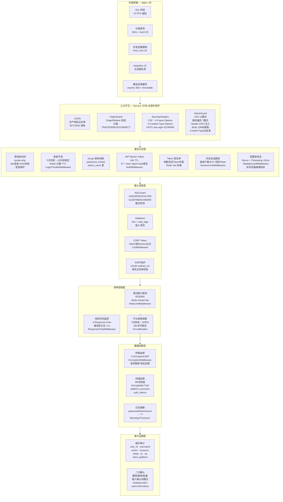
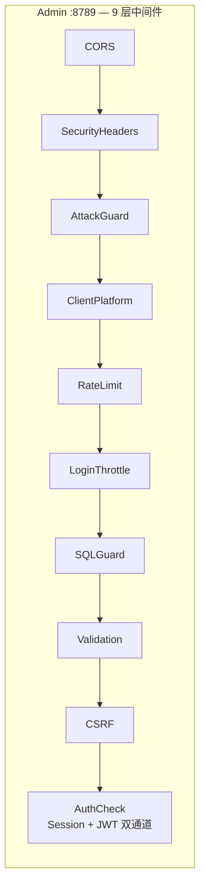

# 安全架构图

Copyright (c) 2026 erik <erik@erik.xyz> — https://erik.xyz

## 纵深防御架构

## Admin 端安全架构

## 安全能力矩阵

| 层次 | 中间件 | Service | Admin | 核心技术 |
|------|--------|---------|-------|----------|
| 网络 | Nginx | ✅ | ✅ | SSL · limit_req · limit_conn |
| 跨域 | CorsMiddleware | ✅ | ✅ | 域名白名单 |
| 来源 | OriginGuardMiddleware | ✅ | — | Origin/Referer校验 |
| 响应头 | SecurityHeadersMiddleware | ✅ | ✅ | CSP · HSTS · XFO · XCTO |
| 攻击检测 | AttackGuardMiddleware | ✅ | ✅ | XSS 11 · 路径遍历 7 · Header注入 |
| 客户端 | ClientPlatformMiddleware | ✅ | ✅ | 8端来源识别 |
| 防重放 | ReplayGuardMiddleware | ✅ | — | Nonce + Timestamp ±5min |
| 限流 | RateLimitMiddleware | ✅ | ✅ | Redis滑动窗口 60/60s |
| 登录节流 | LoginThrottleMiddleware | ✅ | ✅ | 5次→15min Redis |
| 会话限制 | SessionLimitMiddleware | ✅ | — | 最大3活跃Token |
| SQL注入 | SqlGuardMiddleware | ✅ | ✅ | 模式检测 |
| 输入清洗 | ValidationMiddleware | ✅ | ✅ | trim + strip_tags |
| CSRF | CsrfMiddleware | — | ✅ | Session Token比对 |
| 响应时间 | ResponseTimeMiddleware | ✅ | — | X-Response-Time |
| 传输加密 | EncryptionMiddleware | ✅ | — | AES 加解密 |
| 认证 | AuthMiddleware / AuthCheck | ✅ | ✅ | JWT · Session双通道 · IP/UA绑定 |
| 审计 | AuditService | — | ✅ | 操作轨迹记录 |
| 确认 | GlobalConfirm | ✅ | ✅ | 输入确认词模式 |
| 弹性 | CircuitBreaker + GuardedAdapter | ✅ | — | 5次失败→OPEN, 30s半开, per-platform 降级 |

## 22 项防护能力总览

| # | 分类 | 能力 | 机制 |
|---|------|------|------|
| 1 | 输入检测 | XSS 防护 | 11种模式正则匹配 |
| 2 | | 路径遍历防护 | 7种模式检测 |
| 3 | | Header 注入防护 | CRLF 检测 |
| 4 | | Body 大小限制 | 10 MiB 上限 |
| 5 | | Content-Type 白名单 | JSON/Form/Multipart/Plain |
| 6 | | SQL 注入防护 | UNION/DROP/ALTER 模式 |
| 7 | 认证 | JWT Token 绑定 | IP + User-Agent hash |
| 8 | | Token 刷新 + 黑名单 | 旧Token自动失效 |
| 9 | | 登录节流 | 5次失败→15分钟Redis |
| 10 | | 并发会话限制 | 最多3活跃Token |
| 11 | | 验证码 | 滑块5px容差·5min有效 |
| 12 | 请求校验 | CORS 白名单 | 生产域名白名单 |
| 13 | | Origin/Referer 校验 | 跨域来源验证 |
| 14 | | CSRF Token | Session token验证 |
| 15 | | 防重放攻击 | Nonce+Timestamp±5min |
| 16 | | 接口限流 | 滑动窗口60次/60s |
| 17 | | SSRF 防护 | OAuth redirect_uri白名单 |
| 18 | 响应头 | CSP | Content-Security-Policy |
| 19 | | X-Frame-Options / HSTS | 防点击劫持+HTTPS强制 |
| 20 | | X-Content-Type-Options | nosniff |
| 21 | 数据保护 | 传输加密 | EncryptionMiddleware AES |
| 22 | | 存储加密 | Encryptable DB字段级 |
| 23 | | 日志脱敏 | password/token→*** |
