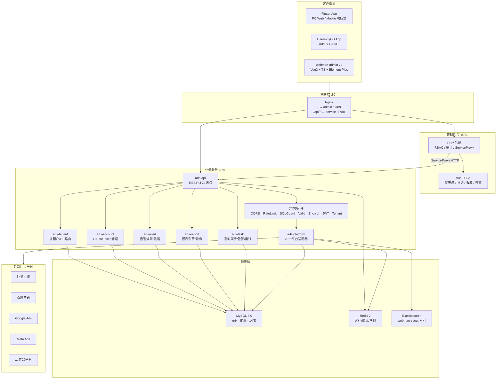
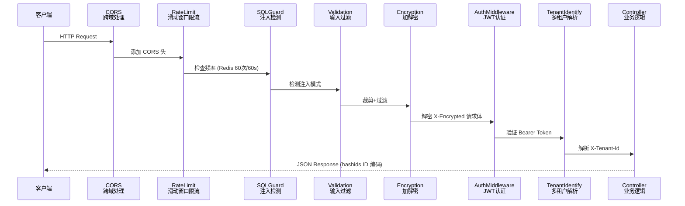
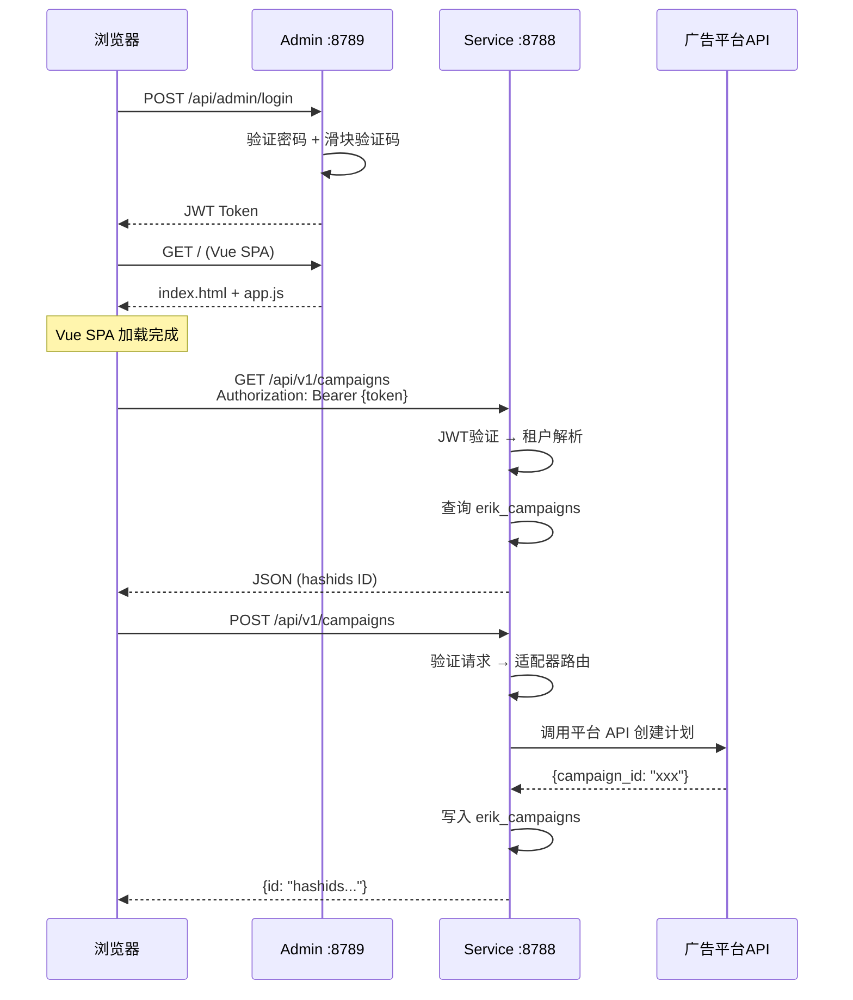
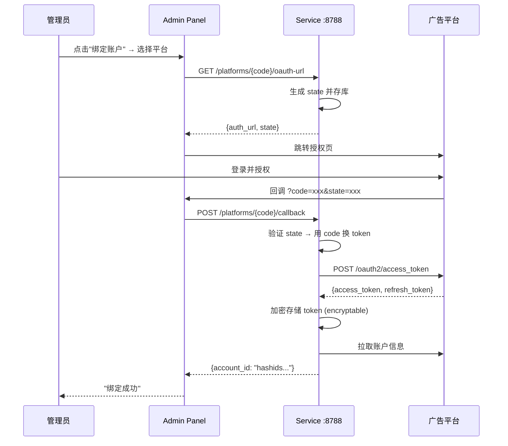
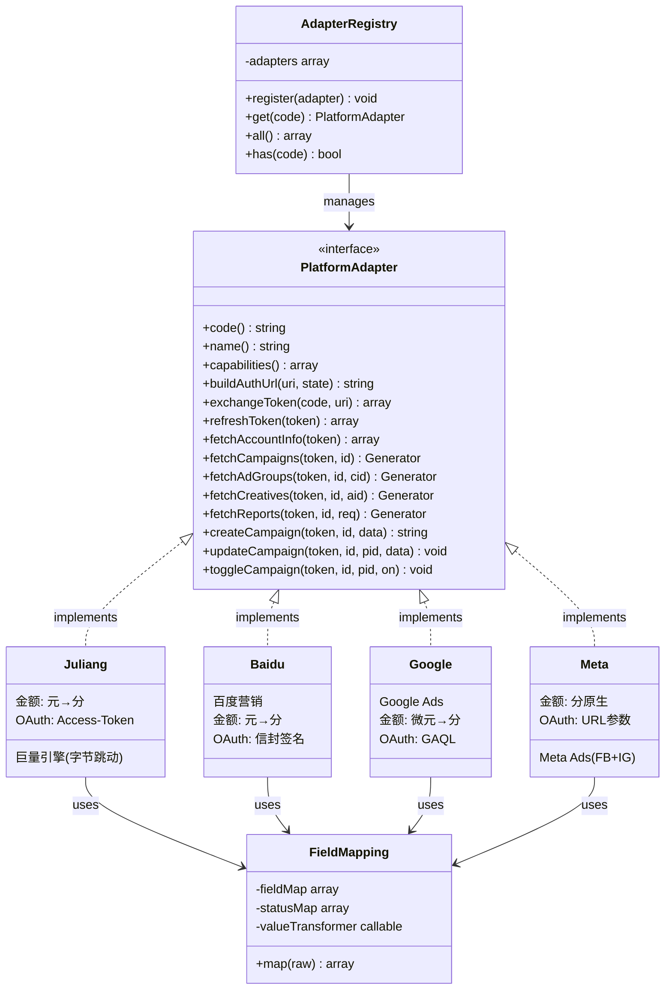
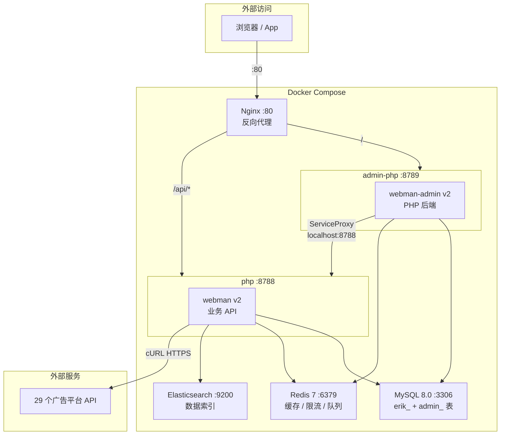
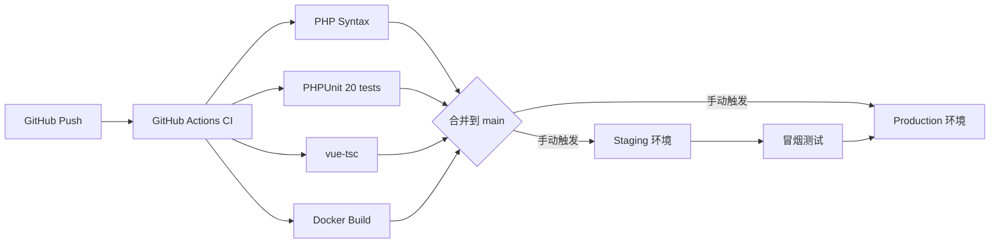

# 多平台广告管理系统设计

Copyright (c) 2026 erik <erik@erik.xyz> — https://erik.xyz

## 概述

对接 **29 个广告平台** 的统一广告管理平台，覆盖国内外主流广告厂商，支持广告投放管理、跨平台数据报表、实时告警监控。

- **service** — 用户端业务服务，webman v2 (PHP 8.2+)，监听 :8788
- **admin** — 独立管理后台，webman-admin v2 (PHP 后端 :8789 + Vue 3 SPA)
- **apps** — 客户端 App，Flutter (iOS/Android/Web PC) + HarmonyOS (ArkTS)
- **基础设施**: Docker + Nginx + MySQL 8.0 + Redis 7 + Elasticsearch

业务场景覆盖自用投放、SaaS 多租户、代运营三种模式。

### 通信架构

```
admin:8789 (管理后台)          service:8788 (业务API)
┌─────────────────┐    HTTP    ┌──────────────────┐
│ webman-admin v2 │ ────────→  │ webman v2 API    │
│ PHP后端+Vue SPA │ ServiceProxy│ 7插件・29适配器   │
└────────┬────────┘            └────────┬─────────┘
         │                              │
    管理操作                        业务数据
  (用户/RBAC/审计)           (广告/报表/告警/同步)
```

---

## 总体架构

### 系统架构图



```
┌──────────────────────────────────────────────────────────┐
│                     Client Layer                          │
│  ┌──────────┐  ┌──────────┐  ┌──────────────────┐       │
│  │ Flutter  │  │HarmonyOS │  │ webman-admin v2  │       │
│  │ App (PC) │  │   App    │  │ (Vue3+TS+Element)│       │
│  └────┬─────┘  └────┬─────┘  └────────┬─────────┘       │
└───────┼──────────────┼────────────────┼─────────────────┘
        │              │                │
        └──────────────┼────────────────┘
                       │ HTTP (hashids ID + JWT + encryption)
           ┌───────────┴───────────┐
           │  Middleware Pipeline   │
           │  CORS → RateLimit →   │
           │  SQLGuard → Valid →   │
           │  Encryption → Tenant  │
           └───────────┬───────────┘
                       │
    ┌──────────────────┼──────────────────┐
    │            Service Layer             │
    │  ┌──────────┐ ┌──────┐ ┌──────────┐ │
    │  │ Campaign │ │Report│ │  Alert   │ │
    │  │ Manager  │ │Engine│ │  Engine  │ │
    │  └────┬─────┘ └──┬───┘ └────┬─────┘ │
    │       └──────────┼──────────┘        │
    │          ┌───────┴────────┐          │
    │          │ Platform       │          │
    │          │ Adapter Layer  │          │
    │          │ (29 adapters)  │          │
    │          └───────┬────────┘          │
    └──────────────────┼───────────────────┘
                       │
    ┌──────────────────┼───────────────────┐
    │       Platform Adapters (29)         │
    │  国内16: Juliang/Baidu/Taobao/...    │
    │  国际13: Google/Meta/TikTok/...       │
    └──────────────────┼───────────────────┘
                       │
              外部广告平台 APIs
```

---

## 一、服务端模块拆解

webman v2 插件化架构，`service/plugin/` 下 7 个插件：

```
service/
├── config/                     # 配置（带注释）
│   ├── app.php, database.php, redis.php
│   ├── middleware.php, server.php
│   ├── log.php, container.php, scout.php
├── support/                    # Erik Stack 工具类
│   ├── ApiResponse.php         # 统一 JSON 响应（含 hashids ID 编码）
│   ├── SnowflakeTrait.php      # 分布式 ID 生成
│   ├── HashidsService.php      # API ID 加解密
│   ├── CacheService.php        # Redis 缓存层
│   └── QueryOptimizer.php      # SQL 优化器
├── plugin/
│   ├── ads-tenant/             # 多租户管理
│   │   ├── model/Tenant.php
│   │   ├── middleware/TenantIdentify.php
│   │   └── migration/create_tenants.sql
│   │
│   ├── ads-account/            # 广告账户 & OAuth 授权（含 encryptable 加密）
│   │   ├── model/PlatformAccount.php, AuthToken.php
│   │   ├── service/OAuthService.php
│   │   └── migration/create_platform_accounts.sql
│   │
│   ├── ads-platform/           # 平台适配器核心
│   │   ├── src/PlatformAdapter.php, AdapterRegistry.php, FieldMapping.php
│   │   ├── src/CampaignData.php, ReportRequest.php
│   │   ├── adapter/            # 29 个适配器（国内16 + 国际13）
│   │   └── migration/create_campaign_tables.sql
│   │
│   ├── ads-api/                # RESTful API（25+ 端点）
│   │   ├── controller/         # 7 个控制器
│   │   ├── middleware/          # 7 个中间件
│   │   └── config/route.php
│   │
│   ├── ads-task/               # 定时任务调度
│   │   ├── task/DataSyncTask.php, TokenRefreshTask.php, AlertCheckTask.php
│   │   └── config/cron.php
│   │
│   ├── ads-report/             # 报表引擎 & 导出
│   │   ├── service/ReportBuilder.php, ReportExporter.php, PdfExporter.php
│   │   └── config/plugin.php
│   │
│   └── ads-alert/              # 告警监控
│       ├── model/AlertRule.php, AlertLog.php
│       ├── service/AlertEngine.php, NotificationService.php
│       └── migration/create_alerts.sql
```

---

## 二、平台适配器

### 已适配平台 (29)

| 地区 | # | 平台 | 适配器类 | 认证 | 金额 | 报表 |
|------|---|------|---------|------|------|------|
| 国内 | 1 | 巨量引擎 | Juliang | OAuth2 Access-Token | 元→分 | 同步分页 |
| 国内 | 2 | 百度营销 | Baidu | OAuth2 + 信封签名 | 元→分 | 异步轮询 |
| 国内 | 3 | 淘宝/阿里妈妈 | Taobao | OAuth2 + MD5签名 | 元→分 | 同步分页 |
| 国内 | 4 | 腾讯广告 | Tencent | OAuth2 + nonce | 分原生 | 同步分页 |
| 国内 | 5 | 快手磁力引擎 | Kuaishou | OAuth2 URL参数 | 元→分 | 同步分页 |
| 国内 | 6 | 小红书蒲公英 | Xiaohongshu | OAuth2 Bearer | 分原生 | 同步分页 |
| 国内 | 7 | 微博粉丝通 | Weibo | OAuth2 Bearer | 分原生 | 同步分页 |
| 国内 | 8 | B站花火 | Bilibili | OAuth2 Bearer | 分原生 | 同步分页 |
| 国内 | 9 | 优酷广告 | Youku | OAuth2 + MD5签名 | 元→分 | 同步分页 |
| 国内 | 10 | 美团广告 | Meituan | OAuth2 Bearer | 分原生 | 同步分页 |
| 国内 | 11 | 知乎广告 | Zhihu | OAuth2 Bearer | 元→分 | 同步分页 |
| 国内 | 12 | 360推广 | Qihoo360 | API Key + Sign | 元→分 | 同步分页 |
| 国内 | 13 | 搜狗推广 | Sogou | API Key + Sign | 元→分 | 同步分页 |
| 国内 | 14 | 友盟 | Umeng | API Key + MD5 | 元→分 | 同步分页 |
| 国内 | 15 | 京东京准通 | Jingdong | OAuth2 + MD5 | 元→分 | 同步分页 |
| 国内 | 16 | 拼多多广告 | Pinduoduo | OAuth2 + 自定义Sign | 分原生 | 同步分页 |
| 国际 | 17 | Google Ads | Google | OAuth2 + GAQL | 微元→分 | pageToken |
| 国际 | 18 | YouTube Ads | Youtube | OAuth2 + GAQL | 微元→分 | pageToken |
| 国际 | 19 | Meta Ads | Meta | OAuth2 URL参数 | 分原生 | 异步 |
| 国际 | 20 | TikTok Ads | Tiktok | OAuth2 Access-Token | 微元→分 | 同步分页 |
| 国际 | 21 | LinkedIn Ads | Linkedin | OAuth2 Bearer | 微元→分 | 同步分页 |
| 国际 | 22 | Snapchat Ads | Snapchat | OAuth2 Bearer | 微元→分 | 同步分页 |
| 国际 | 23 | Pinterest Ads | Pinterest | OAuth2 Bearer | 微元→分 | 同步分页 |
| 国际 | 24 | Twitter/X Ads | Twitter | OAuth2 Bearer | 微元→分 | 同步分页 |
| 国际 | 25 | Amazon Ads | Amazon | OAuth2 + Profile | 分原生 | 异步 |
| 国际 | 26 | The Trade Desk | TheTradeDesk | HMAC-SHA256 | 分原生 | 异步 |
| 国际 | 27 | Spotify Ads | Spotify | OAuth2 Bearer | 分原生 | 异步 |
| 国际 | 28 | Twitch Ads | Twitch | OAuth2 Bearer+ClientId | 分原生 | 同步 |
| 国际 | 29 | Netflix Ads | Netflix | OAuth2 client_credentials | 分原生 | 同步 |

### 接口定义

```php
interface PlatformAdapter
{
    public function code(): string;
    public function name(): string;
    public function capabilities(): array;

    // 授权
    public function buildAuthUrl(string $redirectUri, string $state): string;
    public function exchangeToken(string $code, string $redirectUri): array;
    public function refreshToken(string $refreshToken): array;
    public function fetchAccountInfo(string $accessToken): array;

    // 数据同步（Generator 流式）
    public function fetchCampaigns(string $accessToken, string $accountId): Generator;
    public function fetchAdGroups(string $accessToken, string $accountId, string $campaignId): Generator;
    public function fetchCreatives(string $accessToken, string $accountId, string $adGroupId): Generator;
    public function fetchReports(string $accessToken, string $accountId, ReportRequest $req): Generator;

    // 投放操作
    public function createCampaign(string $accessToken, string $accountId, CampaignData $data): string;
    public function updateCampaign(string $accessToken, string $accountId, string $platformId, CampaignData $data): void;
    public function toggleCampaign(string $accessToken, string $accountId, string $platformId, bool $enabled): void;
}
```

### 字段映射

每个适配器通过 `FieldMapping` 将平台原始字段转为统一模型，平台特有字段自动落入 `extra` JSON。金额统一为 **分**（人民币）/ **分-cent**（美元）。

```php
// 巨量引擎：元→分，百分比→小数
protected array $fieldMap = [
    'campaign_id' => 'platform_campaign_id',
    'stat_cost'   => 'cost',         // 元 → ×100 → 分
    'show_cnt'    => 'impressions',
    'click_cnt'   => 'clicks',
    'ctr'         => 'ctr',          // 百分比 → ÷100 → 小数
];

// Google Ads：微元→分
protected array $fieldMap = [
    'campaign.id'                => 'platform_campaign_id',
    'metrics.cost_micros'        => 'cost',         // 微元 → ÷10000 → 分
    'metrics.impressions'        => 'impressions',
    'metrics.clicks'             => 'clicks',
];
```

---

## 三、数据库设计

### 命名规范
- 表前缀: `erik_`
- 主键: `BIGINT UNSIGNED PRIMARY KEY` (无自增，Snowflake ID 生成)
- 引擎: InnoDB，字符集: utf8mb4

### 核心表 (13张)

```sql
-- 租户
CREATE TABLE erik_tenants (
    id BIGINT UNSIGNED PRIMARY KEY,
    name VARCHAR(100) NOT NULL,
    domain VARCHAR(255) DEFAULT NULL,
    db_type ENUM('shared','dedicated') DEFAULT 'shared',
    db_config JSON NULL,
    plan ENUM('free','pro','enterprise') DEFAULT 'free',
    status TINYINT DEFAULT 1,
    created_at DATETIME DEFAULT CURRENT_TIMESTAMP,
    updated_at DATETIME DEFAULT CURRENT_TIMESTAMP ON UPDATE CURRENT_TIMESTAMP,
    INDEX idx_domain_status (domain, status)
);

-- 平台账户 (access_token/refresh_token 由 encryptable 自动加解密)
CREATE TABLE erik_platform_accounts (
    id BIGINT UNSIGNED PRIMARY KEY,
    tenant_id BIGINT UNSIGNED NOT NULL,
    platform VARCHAR(32) NOT NULL,
    account_id_on_platform VARCHAR(128) NOT NULL,
    account_name VARCHAR(255),
    access_token TEXT,
    refresh_token VARCHAR(512),
    token_expires_at DATETIME,
    status TINYINT DEFAULT 1,
    sync_enabled TINYINT DEFAULT 1,
    last_sync_at DATETIME,
    created_at DATETIME DEFAULT CURRENT_TIMESTAMP,
    updated_at DATETIME DEFAULT CURRENT_TIMESTAMP ON UPDATE CURRENT_TIMESTAMP,
    UNIQUE KEY uk_platform_account (tenant_id, platform, account_id_on_platform),
    INDEX idx_tenant_platform (tenant_id, platform)
);

-- OAuth 状态 Token
CREATE TABLE erik_auth_tokens (
    id BIGINT UNSIGNED PRIMARY KEY,
    tenant_id BIGINT UNSIGNED NOT NULL,
    platform VARCHAR(32) NOT NULL,
    state VARCHAR(64) NOT NULL,
    redirect_uri VARCHAR(512),
    expires_at DATETIME NOT NULL,
    created_at DATETIME DEFAULT CURRENT_TIMESTAMP,
    INDEX idx_state (state)
);

-- 统一广告计划
CREATE TABLE erik_campaigns (
    id BIGINT UNSIGNED PRIMARY KEY,
    tenant_id BIGINT UNSIGNED NOT NULL,
    platform_account_id BIGINT UNSIGNED NOT NULL,
    platform VARCHAR(32) NOT NULL,
    platform_campaign_id VARCHAR(128) NOT NULL,
    name VARCHAR(255) NOT NULL,
    daily_budget BIGINT DEFAULT 0,       -- 单位：分
    total_budget BIGINT DEFAULT 0,
    status VARCHAR(32),
    start_date DATE,
    end_date DATE,
    extra JSON,
    synced_at DATETIME,
    created_at DATETIME DEFAULT CURRENT_TIMESTAMP,
    updated_at DATETIME DEFAULT CURRENT_TIMESTAMP ON UPDATE CURRENT_TIMESTAMP,
    UNIQUE KEY uk_platform_campaign (platform_account_id, platform_campaign_id),
    INDEX idx_tenant (tenant_id)
);

-- 统一广告组
CREATE TABLE erik_ad_groups (
    id BIGINT UNSIGNED PRIMARY KEY,
    campaign_id BIGINT UNSIGNED NOT NULL,
    platform_adgroup_id VARCHAR(128) NOT NULL,
    name VARCHAR(255),
    status VARCHAR(32),
    bid_amount BIGINT DEFAULT 0,
    bid_type VARCHAR(32),
    targeting JSON,
    extra JSON,
    created_at DATETIME DEFAULT CURRENT_TIMESTAMP,
    updated_at DATETIME DEFAULT CURRENT_TIMESTAMP ON UPDATE CURRENT_TIMESTAMP,
    UNIQUE KEY uk_platform_adgroup (campaign_id, platform_adgroup_id)
);

-- 统一创意
CREATE TABLE erik_creatives (
    id BIGINT UNSIGNED PRIMARY KEY,
    ad_group_id BIGINT UNSIGNED NOT NULL,
    platform_creative_id VARCHAR(128) NOT NULL,
    title VARCHAR(500),
    description TEXT,
    media_type VARCHAR(32),
    media_urls JSON,
    landing_url VARCHAR(2048),
    extra JSON,
    created_at DATETIME DEFAULT CURRENT_TIMESTAMP,
    updated_at DATETIME DEFAULT CURRENT_TIMESTAMP ON UPDATE CURRENT_TIMESTAMP,
    UNIQUE KEY uk_platform_creative (ad_group_id, platform_creative_id)
);

-- 报表核心指标
CREATE TABLE erik_report_metrics (
    id BIGINT UNSIGNED PRIMARY KEY,
    tenant_id BIGINT UNSIGNED NOT NULL,
    platform_account_id BIGINT UNSIGNED NOT NULL,
    platform VARCHAR(32) NOT NULL,
    campaign_id BIGINT UNSIGNED,
    ad_group_id BIGINT UNSIGNED,
    creative_id BIGINT UNSIGNED,
    date DATE NOT NULL,
    granularity VARCHAR(16) DEFAULT 'daily',
    cost BIGINT DEFAULT 0,              -- 消耗，单位：分
    impressions BIGINT DEFAULT 0,
    clicks BIGINT DEFAULT 0,
    conversions DECIMAL(10,2) DEFAULT 0,
    ctr DECIMAL(10,6) DEFAULT 0,
    cpm DECIMAL(10,2) DEFAULT 0,
    cpc DECIMAL(10,2) DEFAULT 0,
    cvr DECIMAL(10,6) DEFAULT 0,
    created_at DATETIME DEFAULT CURRENT_TIMESTAMP,
    UNIQUE KEY uk_report (tenant_id, platform, platform_account_id, campaign_id, ad_group_id, creative_id, date, granularity),
    INDEX idx_date (date),
    INDEX idx_campaign_date (campaign_id, date),
    INDEX idx_platform_account (platform_account_id)
);

-- 报表扩展数据
CREATE TABLE erik_report_extras (
    id BIGINT UNSIGNED PRIMARY KEY,
    report_metric_id BIGINT UNSIGNED NOT NULL,
    platform VARCHAR(32) NOT NULL,
    extra JSON,
    FOREIGN KEY (report_metric_id) REFERENCES erik_report_metrics(id) ON DELETE CASCADE
);

-- 告警规则
CREATE TABLE erik_alert_rules (
    id BIGINT UNSIGNED PRIMARY KEY,
    tenant_id BIGINT UNSIGNED NOT NULL,
    name VARCHAR(100) NOT NULL,
    metric VARCHAR(32) NOT NULL,
    condition VARCHAR(16) NOT NULL,
    threshold DECIMAL(12,2) NOT NULL,
    scope VARCHAR(32) DEFAULT 'tenant',
    platform VARCHAR(32),
    campaign_id BIGINT UNSIGNED,
    check_interval INT DEFAULT 5,
    channels JSON,
    enabled TINYINT DEFAULT 1,
    created_at DATETIME DEFAULT CURRENT_TIMESTAMP,
    updated_at DATETIME DEFAULT CURRENT_TIMESTAMP ON UPDATE CURRENT_TIMESTAMP,
    INDEX idx_tenant_enabled (tenant_id, enabled)
);

-- 告警记录
CREATE TABLE erik_alert_logs (
    id BIGINT UNSIGNED PRIMARY KEY,
    tenant_id BIGINT UNSIGNED NOT NULL,
    rule_id BIGINT UNSIGNED NOT NULL,
    rule_name VARCHAR(100) NOT NULL,
    metric VARCHAR(32) NOT NULL,
    current_value DECIMAL(12,2) NOT NULL,
    threshold DECIMAL(12,2) NOT NULL,
    condition VARCHAR(16) NOT NULL,
    status ENUM('triggered','acknowledged','resolved') DEFAULT 'triggered',
    extra JSON,
    created_at DATETIME DEFAULT CURRENT_TIMESTAMP,
    INDEX idx_tenant_status (tenant_id, status),
    INDEX idx_rule (rule_id)
);
```

---

## 四、Erik Stack 集成

| 包 | 用途 | 集成位置 |
|----|------|---------|
| `erikwang2013/snowflake-php` | 分布式主键 ID | SnowflakeTrait → 所有 Model creating 事件 |
| `erikwang2013/hashids` | API 请求/响应 ID 加解密 | ApiResponse 自动编码 id/*_id 字段 |
| `erikwang2013/jwt-webman` | JWT 认证令牌 | AuthMiddleware + AuthController |
| `erikwang2013/encryption` | API 层敏感数据加解密 | EncryptionMiddleware (X-Encrypted 头) |
| `erikwang2013/encryptable` | DB 字段自动加解密 | PlatformAccount/AuthToken $encryptable |
| `erikwang2013/webman-scout` | Elasticsearch 数据同步 | config/scout.php |
| `erikwang2013/season` | 国家旗帜 | PlatformBadge.vue (Unicode 国旗) |
| `erikwang2013/poster-php` | 滑块验证码 | CaptchaService + CaptchaWidget |

---

## 五、国际化 (i18n)

全部界面支持 **中文 (zh-CN)** 和 **English (en)**：

| 端 | 技术 | 翻译量 |
|----|------|--------|
| Admin | vue-i18n v9 | 158 keys (app/nav/login/dashboard/campaign/account/report/alert/system/common) |
| Service API | `erik\support\I18n` | 12 消息 keys (Accept-Language header / ?lang= param) |
| Flutter | AppLocalizations + Delegate | 20+ UI keys |
| HarmonyOS | StringResources | 15+ UI keys |

---

## 六、验证码

登录等敏感操作需完成滑块验证码（erikwang2013/poster-php）：

```
GET  /api/v1/captcha/generate  → 返回背景图 + 拼图块 + AES 加密 token
POST /api/v1/captcha/verify    → 验证偏移量（5px 容差，5 分钟有效）
```

前端 `CaptchaWidget` 组件支持拖拽/触屏，失败自动刷新。后端 AuthController 在登录时校验 captcha_token + captcha_offset。

### 二次确认

删除、解绑、批量操作等敏感操作采用"输入以确认"模式：

| 操作 | 确认方式 | 确认词 |
|------|---------|--------|
| 解绑账户 | 输入账户名称 | 账户名称 |
| 批量启停计划 | 输入固定确认词 | `ENABLE` / `PAUSE` |
| 删除告警规则 | 输入规则名称 | 规则名称 |
| 禁用/启用用户 | 输入用户名 | 用户名 |

通用 `GlobalConfirm` 组件 + `useConfirmStore` Pinia store 驱动，新增敏感操作只需调用 `confirmStore.show({...})`。

---

## 七、安全中间件栈（共 8 层）

### 请求流



| 中间件 | 功能 |
|--------|------|
| CorsMiddleware | 跨域请求处理，支持 X-Tenant-Id/X-Encrypted |
| RateLimitMiddleware | Redis 滑动窗口限流，默认 60次/60秒 |
| SqlGuardMiddleware | SQL 注入模式检测（UNION/DROP/ALTER/注释） |
| ValidationMiddleware | 输入裁剪 + HTML 标签过滤 |
| EncryptionMiddleware | 请求解密 + 响应加密（X-Encrypted 头） |
| AuthMiddleware | JWT Bearer Token 验证（erikwang2013/jwt-webman） |
| TenantIdentify | 多租户解析（X-Tenant-Id 头 / Session） |

---

## 八、Web 管理后台

技术栈: Vue 3 + TypeScript + Element Plus + ECharts 5 + Pinia + Axios

### 已实现页面

```
admin/src/views/
├── login/LoginPage.vue              # 登录
├── dashboard/DashboardPage.vue      # 仪表盘（KPI趋势/平台对比/TOP10/日期筛选/PDF导出）
├── account/
│   ├── AccountList.vue              # 平台账户列表（同步/解绑）
│   └── AccountBind.vue              # OAuth 绑定引导（3步向导）
├── campaign/CampaignList.vue        # 广告计划（CRUD/批量操作/筛选/分页）
├── alert/
│   ├── AlertRuleList.vue            # 告警规则 CRUD
│   └── AlertLogList.vue             # 告警记录（状态筛选/确认）
├── report/ReportExport.vue          # 报表导出（CSV/Excel/PDF）
└── components/
    ├── layout/AppLayout.vue, SideNav.vue, TopBar.vue
    ├── MetricCard.vue               # KPI 指标卡片（含趋势箭头）
    └── PlatformBadge.vue            # 平台标签（含国旗）
```

### TypeScript

- Axios 泛型类型 `UnwrappedInstance` 自动解包 `ApiResponse<T>` 封装
- `vue-tsc --noEmit` **零错误**

---

## 九、Flutter App

PC Web 优先的响应式设计，3 个断点自适应。

| 断点 | 宽度 | 布局 | 导航 |
|------|------|------|------|
| Mobile | < 600px | 单列卡片 | 底部 NavigationBar |
| Tablet | 600-1200px | 双列网格 | Drawer 抽屉 |
| Desktop | > 1200px | 多列网格 + DataTable | 固定 SideNav (250px) |

**PC 端与管理后台分工**:

- **webman-admin**: 重型管理（深度报表/系统配置/租户管理/批量操作）
- **Flutter Web/PC**: 轻量运营面板（实时盯盘/告警处理/轻量投放，无需 VPN）

---

## 十、HarmonyOS App

技术栈: ArkTS + ArkUI。功能与 Flutter App 对齐。

```
entry/src/main/ets/
├── entryability/EntryAbility.ets
├── pages/LoginPage, DashboardPage, CampaignListPage, AccountPage, ReportPage, AlertPage
├── model/Campaign, ReportMetric, PlatformAccount, AlertRule
├── api/ApiClient (GET/POST/PUT/DELETE + Bearer Token)
├── widgets/MetricCard, PlatformBadge, StatusChip, EmptyState
└── utils/FormatUtil
```

---

## 十一、API 设计

前缀 `/api/v1`，统一响应格式：

```json
{
  "code": 0,
  "message": "success",
  "data": {
    "list": [...],
    "pagination": { "page": 1, "per_page": 20, "total": 156, "total_pages": 8 },
    "summary": { "total_cost": 1258000, "avg_ctr": 6.39, "avg_roi": 3.2 }
  }
}
```

### 全部端点

```
# 认证
POST   /api/v1/auth/login
GET    /api/v1/auth/me

# 平台 & 账户
GET    /api/v1/platforms
GET    /api/v1/accounts
GET    /api/v1/accounts/:id
DELETE /api/v1/accounts/:id
POST   /api/v1/accounts/:id/sync
GET    /api/v1/platforms/:code/oauth-url
POST   /api/v1/platforms/:code/callback

# 广告计划
GET    /api/v1/campaigns
POST   /api/v1/campaigns
GET    /api/v1/campaigns/:id
PUT    /api/v1/campaigns/:id
POST   /api/v1/campaigns/:id/toggle

# 报表
GET    /api/v1/reports/summary
GET    /api/v1/reports/custom
GET    /api/v1/reports/export
GET    /api/v1/reports/export-dashboard

# 告警
GET    /api/v1/alerts/rules
POST   /api/v1/alerts/rules
PUT    /api/v1/alerts/rules/:id
DELETE /api/v1/alerts/rules/:id
GET    /api/v1/alerts/logs
POST   /api/v1/alerts/logs/:id/acknowledge
GET    /api/v1/alerts/unread-count
```

---

## 十二、业务逻辑图

### Admin ↔ Service 通信



### OAuth 平台授权流程



### 数据同步 & 告警流程

```mermaid
flowchart TD
    Cron["Crontab 定时触发"]
    
    subgraph Sync["数据同步 (每10分钟)"]
        S1["遍历活跃账户"] --> S2["PlatformRateLimiter<br/>平台级 QPS 控制"]
        S2 --> S3["适配器 fetchCampaigns<br/>Generator 流式分页"]
        S3 --> S4["FieldMapping 字段转换<br/>金额统一为分"]
        S4 --> S5["upsert erik_campaigns<br/>同步时间戳"]
        S3 --> S6["适配器 fetchReports<br/>近2日数据"]
        S6 --> S4
        S4 --> S7["upsert erik_report_metrics<br/>按维度分组"]
        S7 --> S8["CacheService::flush<br/>清仪表盘缓存"]
        S5 --> S8
    end

    subgraph Alert["告警检查 (每5分钟)"]
        A1["遍历启用规则"] --> A2["AlertEngine::evaluate<br/>查询 erik_report_metrics"]
        A2 --> A3{"阈值触发?"}
        A3 -->|是| A4["写入 erik_alert_logs<br/>Redis Pub/Sub"]
        A3 -->|否| A1
        A4 --> A5["NotificationService::send<br/>Web/Email/SMS"]
    end

    subgraph Retry["失败重试 (每3分钟)"]
        R1["扫描 erik_sync_errors<br/>retry_count < 3"] --> R2["重新同步单账户"]
        R2 --> R3{"成功?"}
        R3 -->|是| R4["删除错误记录"]
        R3 -->|否| R5["retry_count+1<br/>指数退避 5^n 分钟"]
    end

    Cron --> Sync
    Cron --> Alert
    Cron --> Retry
```



### 适配器模式



---

## 十三、数据同步 & 任务调度

使用 webman/crontab，Redis 缓存加速。

| 任务 | 频率 | 说明 |
|------|------|------|
| TokenRefreshTask | 每 55 分钟 | 扫描过期 Token，自动刷新 |
| DataSyncTask | 每 10 分钟 | 拉取各平台计划+近2日报表，同步后清仪表盘缓存 |
| AlertCheckTask | 每 5 分钟 | 遍历启用规则，评估阈值，触发推送 |
| RetrySyncTask | 每 3 分钟 | 重试失败同步（erik_sync_errors 表，最多3次，指数退避） |

同步策略：适配器 Generator 流式处理，游标/分页防漏，失败自动重试，curl_errno 检查，平台级 QPS 限流。

---

## 十四、部署架构

### 容器化部署



### 生产部署流



### Docker 一键部署

```bash
docker-compose up -d          # MySQL + Redis + PHP + Nginx
make db-init                  # 初始化数据库
make admin-dev                # 前端开发模式
```

---

## 十五、实施历史

| 阶段 | 内容 | 状态 |
|------|------|------|
| Phase 1 | webman v2 + 管理后台骨架 + 多租户 + OAuth + 巨量 | ✅ |
| Phase 2 | 百度适配器 + 淘宝适配器 + 数据同步 + 报表引擎 | ✅ |
| Phase 3 | 腾讯 + 友盟 + 快手 + 小红书 (4新) | ✅ |
| Phase 4 | 微博 + B站 + 优酷 + 美团 + 知乎 + 360 + 搜狗 + 京东 + 拼多多 (9新国内) | ✅ |
| Phase 4 | Meta + LinkedIn + Snapchat + Pinterest + Twitter + Amazon + TTD + Spotify + Twitch + Netflix + Google + YouTube + TikTok (13新国际) | ✅ |
| Phase 5 | 告警系统 + 报表导出 + Flutter App + HarmonyOS App + 仪表盘增强 | ✅ |
| Phase 6 | Erik Stack 集成（snowflake/hashids/jwt-webman/encryption/encryptable/scout/season）| ✅ |
| Phase 7 | Docker 部署 + 安全加固 (RateLimit/CORS/SQLGuard) + 缓存层 + README | ✅ |
| Phase 8 | 目录重组 (apps/) + Admin 独立 webman-admin v2 (PHP后端+ServiceProxy) + RBAC + 审计日志 | ✅ |
| Phase 9 | API 文档 + 平台速率限制 + 同步重试队列 + PHPUnit 20测试 + GitHub Actions CI/CD | ✅ |
| Phase 10 | 配置文件中文注释 + .env 注释 + 平台凭据文档 + erik_ 表前缀重写 + BIGINT PK | ✅ |
| Phase 11 | 国际化 (vue-i18n + I18n.php + Flutter + HarmonyOS) + 滑块验证码 (poster-php) | ✅ |
| Phase 12 | 二次确认（输入以确认）— 解绑/删除/批量操作均需键入目标名称方可执行 | ✅ |

---

## 十六、Admin 管理后台架构

### PHP 后端（端口 8789）

```
admin/
├── public/web/              # Vue SPA 源码（开发模式 Vite :5173）
├── app/
│   ├── controller/
│   │   ├── AuthController.php       # 管理员登录（JWT）
│   │   ├── AdminUserController.php  # 用户 CRUD（bcrypt 密码）
│   │   ├── AuditLogController.php   # 审计日志查询
│   │   └── ServiceProxy.php         # HTTP 代理 → service:8788
│   ├── middleware/AuthCheck.php     # JWT/Session 双重认证
│   └── service/AuditService.php     # 操作审计写入
├── config/route.php                # Admin API 路由
└── migration/create_admin_tables.sql # admin_users/roles/audit_logs
```

### 角色权限（RBAC）

| 角色 | slug | 权限 |
|------|------|------|
| 超级管理员 | super_admin | `*` 全部权限 |
| 运营经理 | ops_manager | dashboard, campaigns, reports, alerts, accounts |
| 数据分析师 | analyst | dashboard, reports |

### Admin 与 Service 通信

Admin 通过 `ServiceProxy`（cURL）调用 service API，转发 JWT Token。Admin 自身负责认证鉴权和用户管理，业务数据完全由 service 提供。

---

## 十七、测试 & CI/CD

### PHPUnit 测试套件

```bash
cd service && ./vendor/bin/phpunit
# 20 tests / 41 assertions
# FieldMappingTest (5) / HashidsServiceTest (5)
# ReportBuilderTest (3) / CampaignDataTest (3)
# AdapterRegistryTest (4)
```

### GitHub Actions CI

```yaml
Push/PR → PHP Syntax → PHPUnit (MySQL 8.0) → TypeScript (vue-tsc) → Docker Build
```

### Dependabot

每周自动更新 Composer + npm + Docker 依赖。
